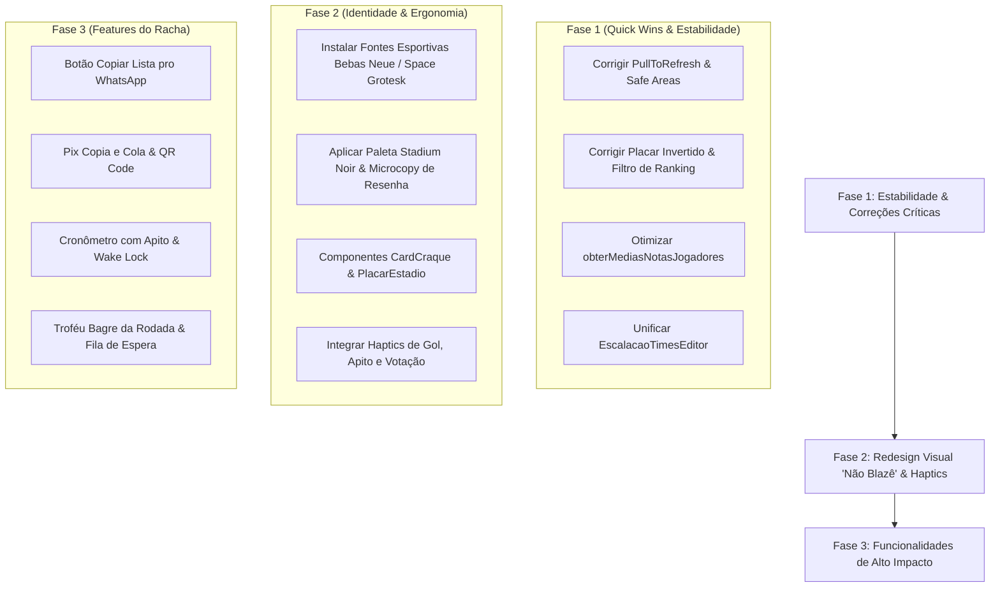

# 📋 Relatório de Auditoria Completa & Plano de Evolução do Racha

**Projeto:** Racha Gragoatá (CBO)  
**Tipo:** PWA / Web App Mobile-First para Futebol Semanal  
**Data:** 14 de Agosto de 2026  
**Status:** Planejado para Implementação  

---

## 📑 Sumário Executivo

Este documento consolida a auditoria técnica, ergonômica, estética e de produto realizada no aplicativo **Racha Gragoatá CBO**. O objetivo é transformar o aplicativo em um ecossistema completo, com alta estabilidade de código, experiência nativa de PWA no celular, direção de arte esportiva moderna (anti-blazê) e todas as ferramentas essenciais para a operação de um racha semanal no Brasil.

---

## 1. 🧼 Qualidade de Código & Code Slop de IA

### 1.1. Gargalo Crítico de Performance: Download da Tabela de Votos
- **Arquivo:** [`src/lib/jogadores.ts`](file:///c:/Users/Rian/Documents/GitHub/racha/src/lib/jogadores.ts#L120-L145)
- **Problema:** A função `obterMediasNotasJogadores()` faz `select("target_id, rating")` baixando todas as linhas históricas da tabela `votes` para calcular as médias em memória no dispositivo do usuário.
- **Impacto:** Conforme o histórico de partidas cresce, causa lentidão, alto consumo de memória e esgotamento do plano de dados no celular.
- **Solução:** Consultar a view já existente `partida_notas` ou realizar agregação SQL direta (`avg_rating` agrupado por `target_id`).

### 1.2. Duplicação Massiva de Telas (85% de Código Idêntico)
- **Arquivos:** [`src/routes/PartidaNovaTimes.tsx`](file:///c:/Users/Rian/Documents/GitHub/racha/src/routes/PartidaNovaTimes.tsx) e [`src/routes/PartidaTimes.tsx`](file:///c:/Users/Rian/Documents/GitHub/racha/src/routes/PartidaTimes.tsx)
- **Problema:** Ambas as telas implementam quase linha por linha a mesma interface e regra de escalação:
  - Trava de 8 atletas por time e 1 goleiro por time.
  - Recálculo de médias de estrelas dos times Preto e Branco.
  - Lógica de `autoEscalar()` e `atribuirTime()`.
  - Mais de 150 linhas de JSX repetidas (chips, botões de toggle e rodapé flutuante).
- **Solução:** Criar o componente compartilhado `EscalacaoTimesEditor.tsx`.

### 1.3. `useEffect`s com Loops e Dependências Frágeis
- **Banner de Lembrete:** Em [`src/components/BannerLembrete.tsx`](file:///c:/Users/Rian/Documents/GitHub/racha/src/components/BannerLembrete.tsx#L53-L59), `pendentes.length` está na lista de dependências do próprio efeito que atualiza `pendentes`, causando re-execução imediata.
- **Contexto de Sessão:** Em [`src/context/SessaoContext.tsx`](file:///c:/Users/Rian/Documents/GitHub/racha/src/context/SessaoContext.tsx#L52-L82), o objeto `value={{ jogador, setJogador, logout }}` é recriado a cada render sem `useMemo`, disparando re-renders em cascata em todo o app.
- **Solução:** Estabilizar com `useCallback`, `useMemo` e remover dependências cíclicas.

### 1.4. Centralização da Camada de Dados e Tipos Supabase
- **Problema:** Queries SQL e chamadas RPC espalhadas arbitrariamente dentro de [`Jogos.tsx`](file:///c:/Users/Rian/Documents/GitHub/racha/src/routes/Jogos.tsx), [`Login.tsx`](file:///c:/Users/Rian/Documents/GitHub/racha/src/routes/Login.tsx), [`Perfil.tsx`](file:///c:/Users/Rian/Documents/GitHub/racha/src/routes/Perfil.tsx) e [`Estatisticas.tsx`](file:///c:/Users/Rian/Documents/GitHub/racha/src/routes/Estatisticas.tsx).
- **Solução:** Centralizar as consultas em módulos de serviço (`src/lib/partidas.ts`, `src/lib/jogadores.ts`, `src/lib/stats.ts`) e tipar os retornos eliminando `any`.

---

## 2. 📱 Qualidade UX Mobile & Ergonomia PWA

### 2.1. Touch Targets Minúsculos (Beira de Quadra com Mão Suada)
- **Problema:**
  - Botões de confirmação do Admin em [`PartidaDetalhe.tsx`](file:///c:/Users/Rian/Documents/GitHub/racha/src/routes/PartidaDetalhe.tsx#L503-L548) têm apenas `30px × 30px` e `gap-1` (4px).
  - Chips de jogadores no [`CampoPartida.tsx`](file:///c:/Users/Rian/Documents/GitHub/racha/src/components/CampoPartida.tsx#L41-L45) têm `36px` de altura.
  - Steppers de gols/assistências em [`PartidaEditar.tsx`](file:///c:/Users/Rian/Documents/GitHub/racha/src/routes/PartidaEditar.tsx#L350-L370) têm `28px`.
- **Solução:** Elevar todos os botões de ação para a área padrão de **44–48px** com `touch-manipulation`.

### 2.2. Correção do `PullToRefresh.tsx`
- **Problema:** Em [`src/components/PullToRefresh.tsx`](file:///c:/Users/Rian/Documents/GitHub/racha/src/components/PullToRefresh.tsx#L19-L26), a checagem `if (window.scrollY === 0)` falha porque o container real de scroll é o `<main>` com `overflow-y-auto`. O `window.scrollY` é sempre 0, ativando o pull-to-refresh em scrolls ascendentes no meio da página.
- **Solução:** Verificar o `scrollTop` do elemento pai `<main>` e adicionar feedback tátil ao puxar.

### 2.3. Safe Areas e Viewport no iOS/Android
- **Problema:** Conflito de padding no `body` com `Layout.tsx` faz botões fixos e o último item de listas ficarem cortados sob a Home Bar do iPhone.
- **Solução:**
  - Adicionar `viewport-fit=cover, interactive-widget=resizes-content` no `index.html`.
  - Remover padding do `body` e aplicar espaçamento inferior adequado (`pb-28` / `pb-36`) no container de conteúdo.
  - Adicionar `overscroll-behavior-y: contain` para evitar elasticidade indesejada.

### 2.4. Feedback Tátil (Haptics) Expandido
- **Solução:** Expandir [`src/lib/haptics.ts`](file:///c:/Users/Rian/Documents/GitHub/racha/src/lib/haptics.ts) com:
  - `vibrateGoal()`: Vibração comemorativa dupla ao registrar gol.
  - `vibrateWhistle()`: Vibração marcante para início e fim de jogo.
  - Feedback tátil ao selecionar notas na votação e ao atingir a trava do Pull-to-Refresh.

### 2.5. Resiliência Offline e Conexão Instável
- **Solução:** Implementar hook `useOnlineStatus`, exibir banner sutil de modo offline e salvar cache local (Stale-While-Revalidate) em `localStorage` para Ranking e Jogos carregarem instantaneamente mesmo sem sinal 4G.

---

## 3. 🎨 UX/UI Não Blazê: Direção de Arte "Stadium Noir & Electric Pitch"

### 3.1. Conceito Visual
Substituir o visual genérico de template SaaS (cinza neutro e caixas frias) por uma estética esportiva moderna inspirada em produtos como EA Sports FC, Panini FUT e Strava de futebol:

```css
/* PALETA PRINCIPAL */
--stadium-black: #080B0A;          /* Fundo imersivo estilo noite de estádio */
--stadium-card-dark: #111714;      /* Cards dark com acabamento refinado */
--pitch-green-neon: #00E676;       /* Verde gramado elétrico para destaques */
--craque-gold: #FFB800;            /* Ouro comemorativo para o Craque da Partida */

/* TIME PRETO vs TIME BRANCO */
--team-black-bg: linear-gradient(145deg, #1C1E22 0%, #0A0B0D 100%);
--team-white-bg: linear-gradient(145deg, #FFFFFF 0%, #E2E8F0 100%);
```

### 3.2. Sistema Tipográfico Esportivo (Google Fonts)
1. **`Bebas Neue`**: Números de placar, notas de avaliação (0 a 10) e números de camisa.
2. **`Space Grotesk`**: Títulos de seções, nomes dos jogadores em destaque e cabeçalhos.
3. **`Plus Jakarta Sans`**: Leitura de tabelas, botões e formulários com alta nitidez sob luz solar.

### 3.3. Componentes com Alma
1. **Card Colecionável do Craque da Partida (Estilo FUT/Panini)**: Borda chanfrada dourada, avatar com halo luminoso, nota gigante e estatísticas do jogo.
2. **Placar Eletrônico de Estádio**: Badge pulsante `AO VIVO`, contraste marcante Time Preto × Time Branco e visual de refletores.
3. **Campinho Tático Iluminado**: Gramado com textura de corte esportivo e iluminação de holofotes no [`CampoPartida.tsx`](file:///c:/Users/Rian/Documents/GitHub/racha/src/components/CampoPartida.tsx).
4. **Microcopy com a Resenha Brasileira**:
   - ⏱️ *Aquecendo no vestiário e ajustando as chuteiras...* (Loading)
   - ⚽ *A bola ainda não rolou em 2026. Hora de convocar o racha!* (Sem partidas)
   - ⭐ *Hora da verdade: distribua as notas e eleja o Craque da rodada!* (Votação)
   - 🎯 *Notas na súmula! A resenha vai ferver no grupo.* (Voto enviado)
   - 🟢 *Tô dentro!* / ⏳ *Na dúvida (pedindo liberação)* / 🔴 *Migué / Não vou* (Presença)

---

## 4. ⚽ Funcionalidades em Falta (Product Management)

### 📌 Matriz de Priorização (MoSCoW)

```
       ▲ IMPACTO NO RACHA (Engajamento / Redução de Trabalho do Organizador)
       │
 ALTO  │  [Pix Copia & Cola]      [Fila de Espera FIFO]   [Card Stories/Zap]
       │  [Lista Zap 1-Toque]     [Cronômetro & Apito]    [Troféu Bagre do Jogo]
       │  [Cobrança no Zap]       [Substituição Rápida]   [Livro Caixa do Racha]
       │
 MÉDIO │  [Screen Wake Lock]      [Check-in Presencial]   [Seleção do Mês]
       │  [Minutagem de Gols]     [Balanceamento Tático]  [Luva de Ouro/Garçom]
       │
       └────────────────────────────────────────────────────────────────────────►
         BAIXA                     MÉDIA                  ALTA        COMPLEXIDADE
```

### 4.1. Eixo Presença & Lista Semanal
- **Copiar Lista Formatada para o WhatsApp (1 Toque):** Botão na tela da partida que copia a lista organizada com emojis de confirmados, goleiros, pendentes e desfalques.
- **Fila de Espera Automática (FIFO):** Ao atingir o limite (16 atletas), os excedentes entram na fila de espera. Se um confirmado desistir, o 1º da fila é promovido automaticamente.
- **Prazo Limite de Cancelamento:** Configuração de cut-off time (ex: até 4h antes do jogo).

### 4.2. Eixo Financeiro & Caixa do Racha
- **Pix Copia e Cola & QR Code:** Cadastro da chave Pix do organizador com geração de payload EMV e botão de cópia na tela de dívidas/perfil.
- **Cobrança Amigável 1-Click via WhatsApp:** Botão ao lado de cada devedor com mensagem pronta contendo o valor e a chave Pix.
- **Livro Caixa do Racha:** Extrato simples com receitas (mensalidades e avulsos) vs despesas (aluguel de quadra, bolas, coletes, churrasco).

### 4.3. Eixo Operação em Campo (Beira da Quadra)
- **Cronômetro com Efeitos Sonoros:** Timer regressivo/progressivo integrado na tela `PartidaAoVivo` com apito sonoro de início, intervalo e fim de jogo via Web Audio API.
- **Screen Wake Lock API:** Impede a tela do smartphone de apagar automaticamente enquanto a partida estiver ao vivo.
- **Substituição Rápida de Emergência:** Troca de jogador lesionado no aquecimento sem reiniciar a súmula.

### 4.4. Eixo Gamificação & Resenha
- **Troféu Bagre da Rodada (Caneludo):** Eleição bem-humorada do pior jogador da partida em paralelo ao Craque.
- **Gerador de Cards para WhatsApp & Instagram:** Compartilhamento de card visual com placar final, craque, bagre e artilheiros via `navigator.share`.
- **Luva de Ouro & Garçom do Ano:** Reconhecimento para o goleiro menos vazado e líder de assistências.

---

## 5. 🐛 Funcionalidades Incompletas & Bugs Latentes

| Arquivo | Gravidade | Diagnóstico e Impacto | Solução |
| :--- | :---: | :--- | :--- |
| [`PartidaAoVivo.tsx:432`](file:///c:/Users/Rian/Documents/GitHub/racha/src/routes/PartidaAoVivo.tsx#L432) | 🟡 Média | **Placar Invertido no Modal**: Diálogo exibe `Placar ${golsB} × ${golsA}` (Branco × Preto), invertendo a convenção visual do app. | Corrigir texto para `Preto ${golsA} × ${golsB} Branco`. |
| [`Ranking.tsx:82`](file:///c:/Users/Rian/Documents/GitHub/racha/src/routes/Ranking.tsx#L82) | 🔴 Alta | **Ranking Vazio no Início do Ano**: O slider de mínimo de partidas inicia em `6`. Com menos de 6 partidas realizadas na temporada, a tabela fica vazia para todos. | Limitar o valor inicial a `Math.min(6, maxPartidasReais)`. |
| [`PartidaEditar.tsx:122`](file:///c:/Users/Rian/Documents/GitHub/racha/src/routes/PartidaEditar.tsx#L122) | 🔴 Alta | **Descompasso com `partida_eventos`**: A edição manual de gols altera os contadores em `partidas_participantes` mas não sincroniza o log de eventos do jogo ao vivo. | Adicionar reconciliação ou aviso de edição manual. |
| [`BannerLembrete.tsx:39`](file:///c:/Users/Rian/Documents/GitHub/racha/src/components/BannerLembrete.tsx#L39) | 🟡 Média | **Lembrete para Não Participantes**: Exibe alerta de votação para quem não jogou a partida, gerando erro 403 ao clicar. | Filtrar apenas partidas onde o jogador esteve em `partidas_participantes`. |
| [`GestaoJogadores.tsx:205`](file:///c:/Users/Rian/Documents/GitHub/racha/src/routes/GestaoJogadores.tsx#L205) e [`PartidaTimes.tsx:218`](file:///c:/Users/Rian/Documents/GitHub/racha/src/routes/PartidaTimes.tsx#L218) | 🔴 Alta | **Salvamento em Lote sem Transação**: Dispara 16 requisições REST individuais sem rollback em caso de falha de conexão. | Criar RPC transacional no Postgres (`salvar_times_partida`). |
| [`SessaoContext.tsx:62`](file:///c:/Users/Rian/Documents/GitHub/racha/src/context/SessaoContext.tsx#L62) | 🟡 Média | **Jogador Inativado Continua Logado**: Ao marcar `is_ativo = false` no banco, o client não desloga a sessão local. | Disparar `logout()` se `!data.is_ativo`. |
| [`PartidaVotar.tsx:161`](file:///c:/Users/Rian/Documents/GitHub/racha/src/routes/PartidaVotar.tsx#L161) | 🟡 Média | **Perda de Votos em Queda de Rede**: Se a conexão oscilar antes do envio, todas as 15 notas são perdidas. | Persistir rascunho de votos em `sessionStorage`. |

---

## 6. 📅 Plano de Execução Sugerido


