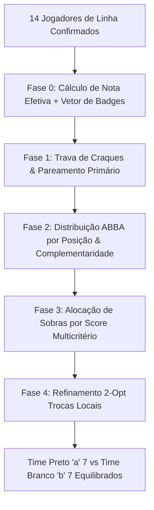

# Algoritmo de Sorteio de Times — "Equilibrar" (Súmula de Quinta)

> **Fonte de Implementação**: `src/lib/escalacao.ts` → `gerarEscalacaoAutomatica()`, orquestrado por `src/hooks/useEscalacaoTimes.ts` (`autoEscalar`).  
> **Propósito do Documento**: Especificação técnica completa do algoritmo de balanceamento de times do **Racha Gragoatá CBO**, integrando o **Nível Técnico (Notas)**, a **Distribuição Posicional (Primária/Secundária)** e o **Sistema de Características & Badges Táticas (2 Gerais + 1 por Posição)**.

---

## 1. Visão Geral e Princípio de Equilíbrio

Uma pelada semanal competitiva não é balanceada apenas pela média escalar de notas (1 a 10). Na prática amadora:

1. **Fôlego & Intensidade**: Se um time concentrar os atletas com mais fôlego ("motorzinhos"), o outro time desmorona fisicamente na segunda metade do racha.
2. **Complementaridade de Funções**: Dois zagueiros construtores que não dão bote, ou dois meias clássicos que não voltam para marcar, desestruturam o sistema tático.
3. **Desequilíbrio de Decisores ("Craques")**: Jogadores com capacidade de drible 1x1 ou finalização letal precisam ser distribuídos equitativamente.

O algoritmo resolve esse problema através de um **modelo multicritério**:
$$\text{Equilíbrio Global} = f(\text{Distribuição Posicional}, \text{Soma de Notas}, \text{Paridade de Fôlego}, \text{Distribuição de Craques/Funções})$$

---

## 2. Entradas do Algoritmo

| Entrada                    | Origem                               | Tipo                                                            | Uso no Algoritmo                                                          |
| :------------------------- | :----------------------------------- | :-------------------------------------------------------------- | :------------------------------------------------------------------------ |
| `jogadores`                | Lista de confirmados (14 de linha)   | `JogadorLista[]`                                                | Atletas disponíveis para o sorteio.                                       |
| `mediasNotas`              | RPC `obter_medias_notas_jogadores()` | `Record<number, number>`                                        | Nível técnico histórico apurado pós-jogos.                                |
| `j.media_nota`             | Fallback no próprio jogador          | `number`                                                        | Fallback quando o jogador ainda não possui RPC agregada.                  |
| `j.posicao`                | Cadastro / Papel no jogo             | `PosicaoId` (`'zagueiro'`, `'lateral'`, `'meia'`, `'atacante'`) | Agrupamento de pares e espelhamento posicional base.                      |
| `j.posicao_b`              | Cadastro do atleta                   | `PosicaoId \| null`                                             | Refinamento posicional e desempate nas sobras.                            |
| `j.caracteristicas_gerais` | Cadastro do atleta (Perfil)          | `[CaractGeralId, CaractGeralId]`                                | **2 características gerais** (físico, pegada, drible, visão, raça).       |
| `j.caracteristica_posicao` | Cadastro do atleta (Perfil)          | `CaractPosicaoId`                                               | **1 característica específica** vinculada à posição primária (`posicao`). |

> **Pré-condição**: `jogadores.length >= limitePorTime * 2` (14 jogadores de linha no formato padrão 7x7).  
> **Goleiros**: São selecionados separadamente via seletores dedicados na UI (`goleiroA` e `goleiroB`), operando fora do sorteio automático da linha.

---

## 3. Catálogo Canônico de Características & Badges

Cada atleta possui **exatamente 3 características cadastradas**:

- **2 Características Gerais** (escolhidas de um pool transversal a qualquer posição);
- **1 Característica Específica** (escolhida do catálogo restrito à sua posição primária).

```
┌─────────────────────────────────────────────────────────────┐
│                    PERFIL DO JOGADOR                        │
│                                                             │
│  [Posição Primária: MEIA]        [Posição Secundária: LAT]  │
│                                                             │
│  ⭐ Características Gerais (2 obrigatórias):                │
│     [ 🏃 Motorzinho (Muito Fôlego) ]  [ 🎯 Chute Forte ]    │
│                                                             │
│  🎯 Característica da Posição (1 obrigatória p/ MEIA):      │
│     [ 🧠 Maestro / Visão ]                                  │
└─────────────────────────────────────────────────────────────┘
```

### 3.1 Catálogo de Características Gerais (Escolhe 2)

| ID                | Nome Canônico              | Ícone / Badge | Eixo / Impacto no Algoritmo                                               |
| :---------------- | :------------------------- | :------------ | :------------------------------------------------------------------------ |
| `folego_infinito` | **Motorzinho**             | 🏃 `FOLEGO`   | **Físico / Alta Intensidade**: Corre o jogo todo, recompõe em velocidade. |
| `cadenciado`      | **Ritmo Cadenciado**       | ⏱️ `CADENCIA` | **Físico / Gestão de Energia**: Joga no passe, cansa no final se exposto. |
| `craque`          | **Craque / Desequilíbrio** | ⭐ `CRAQUE`   | **Técnico / 1x1**: Capacidade de criar gols do nada e decidir jogadas.    |
| `raca`            | **Raça / Pulmão**          | 🛡️ `RACA`     | **Atitude / Combate**: Ganha divididas e pressiona sem bola.              |
| `chute_forte`     | **Chute Forte / De Fora**  | 🚀 `CANHAO`   | **Finalização**: Ameaça de média distância / bola parada.                 |
| `driblador`       | **Drible Curto**           | ⚡ `DRIBLE`   | **Habilidade**: Sai da pressão em espaços curtos.                         |
| `passe_longo`     | **Lançamento / Inversão**  | 🎯 `PASSE`    | **Transição**: Inverte o jogo com precisão de longa distância.            |
| `lideranca`       | **Voz / Organização**      | 🗣️ `LIDER`    | **Tático**: Cobra posicionamento e orienta o time em campo.               |

---

### 3.2 Catálogo Específico por Posição Primária (Escolhe 1)

#### 🛡️ Zagueiro (`posicao = 'zagueiro'`)

| ID               | Nome Canônico                   | Badge            | Impacto Tático                                                    |
| :--------------- | :------------------------------ | :--------------- | :---------------------------------------------------------------- |
| `zag_xerife`     | **Xerife / Rebatedor**          | 🧱 `XERIFE`      | Zagueiro de força física, desarme firme e imposição na área.      |
| `zag_saida_bola` | **Construtor / Saída Limpa**    | 🦶 `SAIDA_LIMPA` | Qualidade no primeiro passe, não dá chutão, constrói de trás.     |
| `zag_tempo_bola` | **Corte Preciso / Antecipação** | ⏱️ `TEMPO_BOLA`  | Desarma na bola sem falta, leitura de jogadas e cobertura rápida. |
| `zag_aereo`      | **Forte no Jogo Aéreo**         | ✈️ `AEREO`       | Ganha todas as bolas pelo alto na defesa e perigo no escanteio.   |

#### ⚡ Lateral (`posicao = 'lateral'`)

| ID                 | Nome Canônico                    | Badge       | Impacto Tático                                                      |
| :----------------- | :------------------------------- | :---------- | :------------------------------------------------------------------ |
| `lat_ala_ofensivo` | **Ala Ofensivo / Cruzamento**    | 🚀 `ALA`    | Apoia o ataque a todo momento, cria profundidade e cruza bem.       |
| `lat_fechador`     | **Fechador / Terceiro Zagueiro** | 🛡️ `BASE_3` | Fica mais defensivo, garante a cobertura e não deixa o time aberto. |
| `lat_linha_fundo`  | **Explosão / Linha de Fundo**    | ⚡ `FUNDO`  | Velocidade pura na beirada para ganhar no fundo e tocar atrás.      |
| `lat_combinacao`   | **Tabelador / Passe Curto**      | 🔄 `TABELA` | Apoio por dentro, tabela rápida e triangulação no meio.             |

#### 🧠 Meia (`posicao = 'meia'`)

| ID                | Nome Canônico                   | Badge            | Impacto Tático                                                   |
| :---------------- | :------------------------------ | :--------------- | :--------------------------------------------------------------- |
| `mei_maestro`     | **Maestro / Dita o Ritmo**      | 🧠 `MAESTRO`     | Visão panorâmica, acha passes nas costas da zaga e dita o ritmo. |
| `mei_pegador`     | **Volante / Cão de Guarda**     | 🛑 `VOLANTE`     | Primeiro volante de marcação pesada, desarme e proteção de área. |
| `mei_infiltrador` | **Pisador / Meia Artilheiro**   | 🏹 `INFILTRADOR` | Chega na área como elemento surpresa para finalizar jogadas.     |
| `mei_drible_giro` | **Gira Fácil / Protege a Bola** | 🌀 `PROTEGE`     | Não perde a posse sob pressão, gira rápido e distribui.          |

#### 🎯 Atacante (`posicao = 'atacante'`)

| ID                | Nome Canônico             | Badge        | Impacto Tático                                                      |
| :---------------- | :------------------------ | :----------- | :------------------------------------------------------------------ |
| `ata_pivo`        | **Pivô / Jogo de Costas** | 🏋️ `PIVO`    | Segura os zagueiros, protege a bola e serve quem vem de trás.       |
| `ata_oportunista` | **Oportunista / Matador** | 🎯 `MATADOR` | Letal dentro da área, 1 toque para o gol, excelente posicionamento. |
| `ata_velocista`   | **Ponta Agudo / 1x1**     | ⚡ `AGUDO`   | Atacante de beirada, quebra linhas no drible e em velocidade.       |
| `ata_falso_9`     | **Móvel / Flutuador**     | 🔀 `FALSO_9` | Recua para buscar jogo, abre espaço para infiltração de meias.      |

---

## 4. Constantes e Pesos do Algoritmo

| Constante           | Valor  | Significado / Racional                                                       |
| :------------------ | :----- | :--------------------------------------------------------------------------- |
| `NOTA_PADRAO`       | `6.0`  | Nota atribuída a jogadores estreantes sem avaliações registradas.            |
| `JITTER_NOTA`       | `±0.1` | Ruído pseudo-aleatório pré-calculado para garantir variabilidade controlada. |
| `limitePorTime`     | `7`    | Limite de jogadores de linha por time (14 confirmados no total).             |
| `PESO_POSICAO`      | `2.0`  | Prioridade na simetria de posições (ex: 2 zagueiros para cada lado).         |
| `PESO_NOTA`         | `0.6`  | Força técnica da soma de notas acumuladas.                                   |
| `PESO_FOLEGO`       | `1.5`  | **Paridade de atletas com `folego_infinito`** (evita times cansados).        |
| `PESO_CRAQUE`       | `2.5`  | **Distribuição obrigatória de `craque`** (1 para cada time se houverem 2).   |
| `PESO_COMPLEMENTAR` | `0.8`  | Complementaridade de papéis específicos (ex: 1 xerife + 1 construtor).       |

---

## 5. Funcionamento Passo a Passo



---

### 5.1 Fase 0 — Preparação dos Atletas

1. **Nota Efetiva**:
   $$\text{nota} = \text{round}(\text{media\_nota} \lor \text{mediasNotas}[id] \lor 6.0, 2)$$
   $$\text{notaEfetiva} = \text{nota} + \text{random}(-0.1, +0.1)$$
   _(Sorteada exatamente uma vez por atleta antes de qualquer ordenação para manter estabilidade)._

2. **Extração de Flags Táticas**:
   - `is_craque` = `caracteristicas_gerais.includes('craque')`
   - `is_folego` = `caracteristicas_gerais.includes('folego_infinito')`
   - `is_marcador` = `caracteristicas_gerais.includes('raca')` ou `caracteristica_posicao.includes('pegador')` ou `caracteristica_posicao.includes('xerife')` ou `caracteristica_posicao.includes('fechador')`

---

### 5.2 Fase 1 — Trava de Craques & Pareamento Primário

1. **Trava de Decisores ("Craques")**:
   - Se houverem atletas com a tag `craque`:
     - Ordena os craques por `notaEfetiva`.
     - Emparelha: o 1º craque vai para a lista prioritária do Time A e o 2º para o Time B.
     - Isso impede que os dois jogadores mais desequilibrantes da noite caiam no mesmo time.

2. **Agrupamento por Posição Primária**:
   - Agrupa os atletas restantes por `posicao` (`zagueiro`, `lateral`, `meia`, `atacante`).
   - Dentro de cada posição, ordena por `notaEfetiva` decrescente.

---

### 5.3 Fase 2 — Alocação de Pares com Complementaridade

Para cada grupo de posição (ex: 4 zagueiros: $Z_1, Z_2, Z_3, Z_4$):

1. Forma pares de extremos: $(Z_1 \leftrightarrow Z_4)$ e $(Z_2 \leftrightarrow Z_3)$.
2. **Critério de Complementaridade**: Se $Z_1$ for `zag_xerife` e $Z_2$ for `zag_saida_bola`, o algoritmo prioriza cruzar as características para que ambos os times tenham um zagueiro de força e um de passe.
3. Se `somaNotas(TimeA) <= somaNotas(TimeB)`:
   - Envia o jogador mais forte para o time com menor soma acumulada.
   - Envia o par para o outro time.
4. Se o limite de 7 de um time for atingido, os restantes vão para a **Pilha de Sobras**.

---

### 5.4 Fase 3 — Sobras: Score Multicritério

Para cada jogador restante nas sobras:
Calcula-se o custo/benefício de colocá-lo no Time A ou no Time B:

$$\text{scorePosA} = (\text{qtdPosicao}_B - \text{qtdPosicao}_A) \times 1.0 + (\text{qtdPosB}_B - \text{qtdPosB}_A) \times 0.5$$

$$\Delta\text{Nota}_A = |\text{somaA} + \text{nota}_j - \text{somaB}|$$

$$\Delta\text{Folego}_A = |\text{folegoCount}(A) + (\text{is\_folego} ? 1 : 0) - \text{folegoCount}(B)|$$

$$\Delta\text{Craque}_A = |\text{craqueCount}(A) + (\text{is\_craque} ? 1 : 0) - \text{craqueCount}(B)|$$

**Score Total de Decisão**:
$$\text{ScoreTotal}_A = \text{scorePosA} \times 2.0 - \Delta\text{Nota}_A \times 0.6 - \Delta\text{Folego}_A \times 1.5 - \Delta\text{Craque}_A \times 2.5$$

- $\text{ScoreTotal}_A > \text{ScoreTotal}_B \implies$ aloca no Time Preto (`a`).
- $\text{ScoreTotal}_B > \text{ScoreTotal}_A \implies$ aloca no Time Branco (`b`).

---

### 5.5 Fase 4 — Refinamento Local (2-Opt / Trocas Inteligentes)

Após a alocação gulosa inicial (7 atletas em cada time), o algoritmo executa uma passada rápida de **Refinamento 2-Opt** (máximo 49 combinações):

1. Avalia pares de jogadores $(J_A \in \text{Time A}, J_B \in \text{Time B})$ de mesma posição primária.
2. Calcula a função custo global $J$:
   $$J = 0.6 \cdot |\text{somaA} - \text{somaB}| + 1.5 \cdot |\text{folego}_A - \text{folego}_B| + 2.5 \cdot |\text{craques}_A - \text{craques}_B| + 1.0 \cdot |\text{marcadores}_A - \text{marcadores}_B|$$
3. Se a troca $(J_A \leftrightarrow J_B)$ reduzir $J$, a troca é aceita imediatamente.
4. O loop termina quando nenhuma troca de mesma posição melhora o equilíbrio geral.

---

## 6. Exemplo Prático de Sorteio com Badges

### Elenco da Noite (14 de Linha)

```text
[ZAG] Dico      (7.8★) | Geral: [Motorzinho, Raça]         | Pos: [Xerife]
[ZAG] Tadeu     (7.5★) | Geral: [Liderança, Passe Longo]    | Pos: [Saída Limpa]
[ZAG] André     (6.2★) | Geral: [Ritmo Cadenciado, Raça]   | Pos: [Xerife]
[ZAG] Bruno     (5.8★) | Geral: [Ritmo Cadenciado, Chute]  | Pos: [Tempo de Bola]

[LAT] Vitinho   (7.2★) | Geral: [Motorzinho, Drible]       | Pos: [Ala Ofensivo]
[LAT] Rodrigo   (6.5★) | Geral: [Motorzinho, Raça]         | Pos: [Fechador]
[LAT] Caio      (6.4★) | Geral: [Ritmo Cadenciado, Passe]  | Pos: [Combinação]
[LAT] Renan     (5.9★) | Geral: [Motorzinho, Chute]        | Pos: [Linha de Fundo]

[MEI] Natal     (8.2★) | Geral: [Craque, Passe Longo]       | Pos: [Maestro]
[MEI] Felipe    (7.6★) | Geral: [Motorzinho, Chute]        | Pos: [Pisador]
[MEI] Lucas     (7.0★) | Geral: [Craque, Drible]           | Pos: [Gira Fácil]
[MEI] Marcio    (6.1★) | Geral: [Raça, Ritmo Cadenciado]   | Pos: [Volante]

[ATA] Gabriel   (8.0★) | Geral: [Motorzinho, Chute]        | Pos: [Ponta Agudo]
[ATA] Leo       (6.8★) | Geral: [Ritmo Cadenciado, Raça]   | Pos: [Pivô]
```

### Resultado Gerado pelo Algoritmo

```text
━━━━━━━━━━━━━━━━━━━━━━━━━━━━━━━━━━━━━━━━━━━━━━━━━━━━━━━━━━━━
TIME PRETO (7 de linha)           TIME BRANCO (7 de linha)
━━━━━━━━━━━━━━━━━━━━━━━━━━━━━━━━━━━━━━━━━━━━━━━━━━━━━━━━━━━━
[ZAG] Dico     (7.8★) [Xerife]    [ZAG] Tadeu    (7.5★) [Saída Limpa]
[ZAG] Bruno    (5.8★) [Tempo]     [ZAG] André    (6.2★) [Xerife]
[LAT] Vitinho  (7.2★) [Ala]       [LAT] Rodrigo  (6.5★) [Fechador]
[LAT] Caio     (6.4★) [Tabela]    [LAT] Renan    (5.9★) [Linha Fundo]
[MEI] Natal    (8.2★) [Craque]    [MEI] Lucas    (7.0★) [Craque]
[MEI] Marcio   (6.1★) [Volante]   [MEI] Felipe   (7.6★) [Pisador]
[ATA] Leo      (6.8★) [Pivô]      [ATA] Gabriel  (8.0★) [Agudo]
━━━━━━━━━━━━━━━━━━━━━━━━━━━━━━━━━━━━━━━━━━━━━━━━━━━━━━━━━━━━
MÉDIA TÉCNICA:  6.90★             MÉDIA TÉCNICA:  6.96★  (Δ = 0.06★)
MOTORZINHOS:    3 atletas         MOTORZINHOS:    3 atletas (Δ = 0)
CRAQUES:        1 atleta          CRAQUES:        1 atleta  (Δ = 0)
MARCADORES:     3 atletas         MARCADORES:     3 atletas (Δ = 0)
━━━━━━━━━━━━━━━━━━━━━━━━━━━━━━━━━━━━━━━━━━━━━━━━━━━━━━━━━━━━
```

---

## 7. Feedback Visual na Interface (`PartidaTimes.tsx`)

Ao clicar em **"Equilibrar Times"**, a interface exibe a régua de equilíbrio consolidada no padrão visual **Súmula de Quinta**:

```
┌─────────────────────────────────────────────────────────────┐
│  EQUILÍBRIO DA ESCALAÇÃO                         [ EXCELENTE ]│
├─────────────────────────────────────────────────────────────┤
│  ⭐ Nível Técnico:    PRETO 6.9★  vs  6.9★ BRANCO           │
│  🏃 Pulmão/Fôlego:    ⚡ 3 Intensos vs ⚡ 3 Intensos         │
│  🛡️ Combate/Defesa:   🛡️ 3 Marcadores vs 🛡️ 3 Marcadores    │
│  ⭐ Decisores:        ⭐ 1 Craque vs ⭐ 1 Craque             │
└─────────────────────────────────────────────────────────────┘
```

Badges no Card do Atleta:

- Cantos secos: `rounded-[2px]`
- Tipografia: `font-display tracking-wider uppercase`
- Estilo carimbo com borda suave (`border border-borda/60 bg-superficie-2`).

---

## 8. Estrutura de Banco de Dados e Roadmap

### 8.1 Alteração no Banco (`supabase/migrations/`)

```sql
-- Migration sequencial: XXX_adicionar_caracteristicas_jogadores.sql

-- 1. Coluna de características gerais (exatamente 2 itens)
ALTER TABLE public.jogadores
ADD COLUMN caracteristicas_gerais text[] DEFAULT '{}'::text[];

-- 2. Coluna de característica da posição primária (1 item)
ALTER TABLE public.jogadores
ADD COLUMN caracteristica_posicao text DEFAULT NULL;

-- 3. Constraint de integridade
ALTER TABLE public.jogadores
ADD CONSTRAINT chk_max_caracteristicas_gerais
CHECK (cardinality(caracteristicas_gerais) <= 2);
```

### 8.2 Roadmap de Implementação

1. **Fase 1 — Tipagem e Banco**:
   - Migration SQL no padrão 3 dígitos (`XXX_caracteristicas_jogadores.sql`).
   - Atualização da interface `JogadorLista` em `src/lib/jogadores.ts`.
   - Constantes de catálogo em `src/lib/caracteristicas.ts`.

2. **Fase 2 — UI de Gestão de Jogadores**:
   - Adição do seletor tátil de badges no modal de edição/criação em `src/routes/GestaoJogadores.tsx`.
   - Regra de seleção: 2 gerais + 1 posicional (dropdown dinâmico baseado na posição primária escolhida).

3. **Fase 3 — Motor de Escalação (`src/lib/escalacao.ts`)**:
   - Implementação das funções de score multicritério (`scoreFolego`, `scoreCraque`, `scoreComplementar`).
   - Refinamento 2-opt de trocas locais.

4. **Fase 4 — Apresentação e Cards (`src/routes/PartidaTimes.tsx` e `Perfil.tsx`)**:
   - Exibição das plaquetas de badges nos cards de jogadores.
   - Painel informativo de equilíbrio físico e tático pós-sorteio.

---

## 9. Referências no Código

- `gerarEscalacaoAutomatica()` — `src/lib/escalacao.ts`
- `autoEscalar()` — `src/hooks/useEscalacaoTimes.ts`
- `JogadorLista` — `src/lib/jogadores.ts`
- `design-system.md` — Tokens de cor, tipografia de badges e carimbos.
