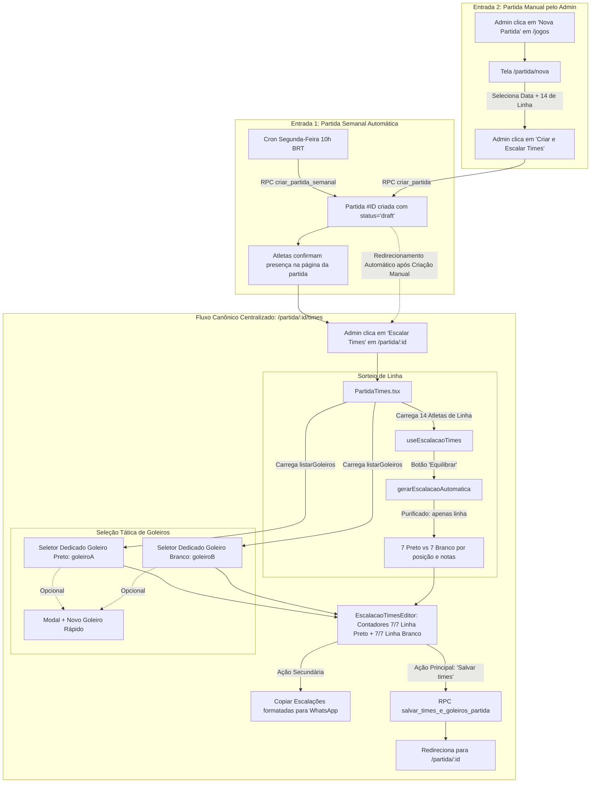

# Plano de Implementação: Unificação da Escalação de Times e Gestão Canônica de Goleiros

> **Documento de Engenharia**: Plano Detalhado de Implementação (Abordagem Recomendada)  
> **Status**: Pronto para Execução  
> **Data**: Agosto de 2026  
> **Autor**: Antigravity (Google DeepMind)  
> **Contexto do Problema**: Anomalia em `/partida/nova/times` onde o algoritmo sorteia goleiros junto com atletas de linha, gerando `8/7 de linha` e travando a criação da partida.  
> **Diretriz Mandatória**: Unificar e centralizar o fluxo de divisão de times em torno da tela canônica da partida semanal (`/partida/:id/times`).

---

## 📑 Sumário

1. [Objetivo e Escopo](#1-objetivo-e-escopo)
2. [Visão Geral da Arquitetura Unificada](#2-visão-geral-da-arquitetura-unificada)
3. [Diagnóstico da Divergência e Correções Necessárias](#3-diagnóstico-da-divergência-e-correções-necessárias)
4. [Detalhamento Técnico das Alterações](#4-detalhamento-técnico-das-alterações)
   - [4.1 Purificação do Algoritmo (`src/lib/escalacao.ts`)](#41-purificação-do-algoritmo-srclibescalaots)
   - [4.2 Reformulação da Criação Manual (`src/routes/PartidaNova.tsx`)](#42-reformulação-da-criação-manual-srcroutespartidanovattsx)
   - [4.3 Eliminação de Rotas e Telas Duplicadas](#43-eliminação-de-rotas-e-telas-duplicadas)
   - [4.4 Ajustes no Roteador e Prefetch (`src/App.tsx`, `src/lib/rotas.ts`, `src/routes/Layout.tsx`)](#44-ajustes-no-roteador-e-prefetch-srcapptsx-srclibrotasts-srcrouteslayouttsx)
   - [4.5 Validação das RPCs do Banco de Dados (`supabase/`)](#45-validação-das-rpcs-do-banco-de-dados-supabase)
   - [4.6 Atualização da Documentação Canônica (`docs/`)](#46-atualização-da-documentação-canônica-docs)
5. [Plano de Execução Passo a Passo](#5-plano-de-execução-passo-a-passo)
6. [Matriz de Testes e Critérios de Aceite](#6-matriz-de-testes-e-critérios-de-aceite)
7. [Rollback e Gestão de Riscos](#7-rollback-e-gestão-de-riscos)

---

## 1. Objetivo e Escopo

### 1.1 Objetivo

Eliminar a disparidade de comportamento entre a criação manual de partida (`/partida/nova/times`) e a partida semanal criada automaticamente na segunda-feira (`/partida/:id/times`), estabelecendo **uma única tela, um único hook e uma única regra algorítmica** para o sorteio de times e a gestão de goleiros.

### 1.2 Escopo de Mudanças

- **Refatorar** o algoritmo `gerarEscalacaoAutomatica` em `src/lib/escalacao.ts` para atuar estritamente sobre jogadores de linha (14 atletas → 7 Preto vs 7 Branco).
- **Simplificar** a rota `/partida/nova` (`src/routes/PartidaNova.tsx`) para selecionar data e os 14 confirmados de linha, criando imediatamente a partida em `draft` no Supabase e redirecionando para a tela canônica `/partida/:id/times`.
- **Eliminar** as rotas redundantes `/partida/nova/confirma` (`PartidaConfirma.tsx`) e `/partida/nova/times` (`PartidaNovaTimes.tsx`).
- **Atualizar** o roteamento central (`App.tsx`), os imports lazy com prefetch (`src/lib/rotas.ts`) e o shell de layout (`Layout.tsx`).
- **Atualizar** a documentação do algoritmo em `docs/algoritmo-sorteio-times.md`.

---

## 2. Visão Geral da Arquitetura Unificada

### 2.1 Fluxo Único de Criação e Escalação de Partidas



---

## 3. Diagnóstico da Divergência e Correções Necessárias

### 3.1 Causa Raiz do Bug `8/7 de linha`

1. **Entrada Mista na Criação Manual**: `PartidaNova.tsx` exigia selecionar 14 de linha + 2 goleiros (16 no total) e enviava todos para `PartidaNovaTimes.tsx`.
2. **Sobrecarga do Algoritmo**: `gerarEscalacaoAutomatica` em `src/lib/escalacao.ts` continha a "Fase 1 (Goleiros)", que separava 1 goleiro para o Time A e 1 para o Time B, além de 7 jogadores de linha para cada time.
3. **Ausência dos Seletores Dedicados de Goleiro**: `PartidaNovaTimes.tsx` não passava as propriedades de goleiro para `EscalacaoTimesEditor.tsx`. Como consequência, o componente tratava os 16 atletas como jogadores de linha normais, exibindo `8/7 de linha` (estouro de cota) e bloqueando o salvamento.

### 3.2 Benefícios da Abordagem Recomendada

- **Redução Drástica de Código**: Menos ~450 linhas de código duplicado e arquivos deletados (`PartidaConfirma.tsx`, `PartidaNovaTimes.tsx`).
- **Consistência Total**: O botão "Equilibrar" e os seletores de goleiro passam a funcionar **exatamente da mesma forma** em qualquer cenário.
- **Robustez contra Perda de Estado**: O estado da partida passa a ser persistido diretamente no PostgreSQL como `draft`, eliminando a fragilidade de repassar dados complexos via `location.state` entre 3 etapas de formulário.

---

## 4. Detalhamento Técnico das Alterações

### 4.1 Purificação do Algoritmo (`src/lib/escalacao.ts`)

#### Arquivo: `src/lib/escalacao.ts`

- **Remover** o bloco da Fase 1 (`goleiros = jogadoresComNota.filter(j => j.posicao === 'goleiro')` e sua distribuição alternada).
- **Assumir** como pré-condição formal que `jogadores` contém estritamente jogadores de linha (`posicao !== 'goleiro'`).
- **Garantir** que `limitePorTime = Math.ceil(jogadores.length / 2)` resulte em exatamente `7` quando fornecidos 14 jogadores.

```typescript
// Trecho refatorado em src/lib/escalacao.ts:
export function gerarEscalacaoAutomatica(
  jogadores: JogadorLista[],
  mediasNotas?: Record<number, number>
): ParticipanteForm[] {
  const limitePorTime = Math.ceil(jogadores.length / 2);

  // Atribuição de notas (padrão 6.0 se não tiver avaliação) com jitter fixo
  const jogadoresComNota: JogadorComRating[] = jogadores.map((j) => {
    const notaCalculada = mediasNotas?.[j.id] ?? NOTA_PADRAO;
    const nota = Number(notaCalculada.toFixed(2));
    return {
      ...j,
      nota,
      notaEfetiva: nota + (Math.random() * 2 * JITTER_NOTA - JITTER_NOTA),
    };
  });

  // Lista de linha embaralhada (goleiros são gerenciados separadamente na UI de times)
  const linha = embaralhar(jogadoresComNota);

  const timeA: JogadorComRating[] = [];
  const timeB: JogadorComRating[] = [];

  function somaNotas(time: JogadorComRating[]): number {
    return time.reduce((acc, j) => acc + j.nota, 0);
  }

  // 1. Agrupar jogadores de linha por posição primária (posicao)
  const gruposPosicao: Record<string, JogadorComRating[]> = {};
  for (const j of linha) {
    const pos = j.posicao;
    if (!gruposPosicao[pos]) gruposPosicao[pos] = [];
    gruposPosicao[pos]!.push(j);
  }

  // [Fases 2 e 3 de emparelhamento ABBA e sobras permanecem idênticas]
  // ...
```

---

### 4.2 Reformulação da Criação Manual (`src/routes/PartidaNova.tsx`)

#### Arquivo: `src/routes/PartidaNova.tsx`

- **Ajustar Seleção**: A tela foca na seleção da **Data do Jogo** e dos **14 Jogadores de Linha Titulares** (Mensalistas + Avulsos). A seleção de goleiros é removida desta etapa, pois eles serão escalados nos slots dedicados da tela de times.
- **Cota Visual**: Mantém o card de cota de linha (`0/14`).
- **Ação Principal**: O botão inferior "Avançar para Escalação" (`Revisar e Escalar Times`):
  1. Dispara a criação da partida chamando `supabase.rpc('criar_partida', { p_data_jogo, p_criado_por, p_participantes })`.
  2. Passa os 14 jogadores selecionados com `posicao: j.posicao`, `time: null`, `status_confirmacao: 'confirmado'`.
  3. Limpa o `localStorage` do rascunho.
  4. Invalida os caches `CHAVE_JOGOS` e `chaveResumo`.
  5. Redireciona imediatamente para `/partida/${partidaId}/times`.

```typescript
// Fluxo do CTA em src/routes/PartidaNova.tsx:
async function handleCriarEEscalar() {
  if (!adminLogado || !podeAvancar) return;
  setSalvando(true);
  setErro(null);

  try {
    const dataIso = new Date(`${dataJogo}T${HORA_PADRAO}`).toISOString();
    const payloadParticipantes = selecionados.map((id) => {
      const j = jogadores.find((x) => x.id === id);
      return {
        jogador_id: id,
        posicao: j?.posicao ?? 'random',
        time: null,
        gols: 0,
        assistencias: 0,
        gols_contra: 0,
      };
    });

    const { data: novaPartidaId, error } = await supabase.rpc('criar_partida', {
      p_data_jogo: dataIso,
      p_criado_por: adminLogado.id,
      p_participantes: payloadParticipantes,
    });

    if (error) throw error;
    if (!novaPartidaId) throw new Error('Falha ao criar partida.');

    try {
      localStorage.removeItem(STORAGE_KEY);
    } catch {
      // Ignora falha de storage
    }

    invalidarCache(CHAVE_JOGOS);
    invalidarCache(chaveResumo(new Date().getFullYear()));

    navigate(`/partida/${novaPartidaId}/times`, { replace: true });
  } catch (err) {
    setErro(formatarMensagemErro(err, 'Não foi possível criar a partida.'));
  } finally {
    setSalvando(false);
  }
}
```

---

### 4.3 Eliminação de Rotas e Telas Duplicadas

Os seguintes arquivos serão **removidos do repositório**:

- `src/routes/PartidaConfirma.tsx` (Etapa intermediária redundante).
- `src/routes/PartidaNovaTimes.tsx` (Tela duplicada e divergente de divisão de times).

---

### 4.4 Ajustes no Roteador e Prefetch (`src/App.tsx`, `src/lib/rotas.ts`, `src/routes/Layout.tsx`)

#### Arquivo: `src/App.tsx`

- Remover as tags `<Route path="/partida/nova/confirma" ... />` e `<Route path="/partida/nova/times" ... />`.
- Manter apenas `<Route path="/partida/nova" element={<PartidaNova />} />` e `<Route path="/partida/:id/times" element={<PartidaTimes />} />`.

#### Arquivo: `src/lib/rotas.ts`

- Remover os imports dinâmicos `carregarPartidaConfirma` e `carregarPartidaNovaTimes`.
- Remover as constantes exportadas `PartidaConfirma` e `PartidaNovaTimes`.
- Remover os padrões do array `MAPA_PREFETCH`:
  ```diff
  - { padrao: /^\/partida\/nova\/confirma/, carregar: carregarPartidaConfirma },
  - { padrao: /^\/partida\/nova\/times/, carregar: carregarPartidaNovaTimes },
  ```

#### Arquivo: `src/routes/Layout.tsx`

- Atualizar a expressão regular de fluxo focado (`isFluxoFocado`):
  ```typescript
  const isFluxoFocado = /^\/partida\/(nova|\d+\/(votar|editar|ao-vivo|times))/.test(pathname);
  ```

---

### 4.5 Validação das RPCs do Banco de Dados (`supabase/`)

1. **RPC `criar_partida`** (`supabase/aplicar_tudo.sql:911`):
   - Já suporta a inserção de participantes em `draft` com `time` nulo e `status_confirmacao = 'confirmado'`.
   - Nenhuma alteração DDL ou migration necessária no banco de dados.
2. **RPC `salvar_times_e_goleiros_partida`** (`supabase/aplicar_tudo.sql:1205`):
   - Já valida a integridade atômica: 7 jogadores de linha no time `a`, 7 no time `b`, e os 2 goleiros especificados (`p_goleiro_a_id`, `p_goleiro_b_id`).
   - Usada nativamente por `PartidaTimes.tsx`.

---

### 4.6 Atualização da Documentação Canônica (`docs/`)

#### Arquivo: `docs/algoritmo-sorteio-times.md`

- Remover menções à "Fase 1 (Goleiros)".
- Documentar explicitamente que o algoritmo processa apenas jogadores de linha e que a seleção de goleiros é realizada na interface através de seletores dedicados.

---

## 5. Plano de Execução Passo a Passo

```text
[FASE 1] Purificação do Algoritmo de Sorteio
 └── 1.1 Editar `src/lib/escalacao.ts` para remover a Fase 1 de goleiros.
 └── 1.2 Atualizar `docs/algoritmo-sorteio-times.md`.

[FASE 2] Refatoração de PartidaNova.tsx
 └── 2.1 Atualizar `src/routes/PartidaNova.tsx`:
       - Remover seletor e cota de goleiros da Etapa 1.
       - Manter cota de 14 jogadores de linha titulares.
       - Integrar chamada direta à RPC `criar_partida`.
       - Adicionar feedback de loading/erro e redirecionamento para `/partida/:id/times`.

[FASE 3] Limpeza de Código e Roteamento
 └── 3.1 Deletar `src/routes/PartidaConfirma.tsx` e `src/routes/PartidaNovaTimes.tsx`.
 └── 3.2 Atualizar `src/lib/rotas.ts` (remover imports lazy e prefetch excluídos).
 └── 3.3 Atualizar `src/App.tsx` (remover rotas órfãs).
 └── 3.4 Atualizar `src/routes/Layout.tsx` (ajustar regex isFluxoFocado).

[FASE 4] Verificação, Build e Testes
 └── 4.1 Executar `npx tsc -b` para validação estrita de tipos TypeScript.
 └── 4.2 Executar `npm run build` para garantir integridade do bundle Vite.
 └── 4.3 Formatar arquivos com Prettier (`npx prettier --write .`).
 └── 4.4 Executar testes manuais de ponta a ponta em ambos os fluxos.
```

---

## 6. Matriz de Testes e Critérios de Aceite

| ID        | Cenário de Teste                        | Procedimento                                                                                                      | Critério de Aceite                                                                                                                |
| :-------- | :-------------------------------------- | :---------------------------------------------------------------------------------------------------------------- | :-------------------------------------------------------------------------------------------------------------------------------- |
| **TC-01** | **Criação de Partida Manual**           | Acessar `/partida/nova`, selecionar data futura e marcar 14 atletas de linha. Clicar em "Avançar para Escalação". | Partida é criada no banco em status `draft` e usuário é redirecionado instantaneamente para `/partida/:id/times`.                 |
| **TC-02** | **Botão Equilibrar na Partida Manual**  | Em `/partida/:id/times`, clicar em "Equilibrar".                                                                  | Sorteia 7 de linha no Preto e 7 de linha no Branco. Placar exibe `7/7 de linha` (verde). Goleiros não são alterados pelo sorteio. |
| **TC-03** | **Seleção e Troca de Goleiros**         | Na tela de times, clicar nos seletores de goleiro do Preto e do Branco.                                           | Permite escolher 1 goleiro para cada time via modal. Impede selecionar o mesmo atleta nos dois lados ou atleta já na linha.       |
| **TC-04** | **Botão Equilibrar na Partida Semanal** | Acessar `/partida/:id/times` de uma partida agendada de segunda-feira com 14 confirmados. Clicar em "Equilibrar". | Comportamento 100% idêntico ao TC-02: 7x7 de linha, sem interferir nos goleiros.                                                  |
| **TC-05** | **Copiar Escalações (WhatsApp)**        | Clicar no botão "Copiar escalações".                                                                              | Copia o texto formatado: Goleiro no topo de cada time, seguido dos 7 de linha ordenados por posição e médias calculadas.          |
| **TC-06** | **Salvamento da Escalação**             | Com 7 de linha no Preto, 7 de linha no Branco e os 2 goleiros escolhidos, clicar em "Salvar times".               | Salva via RPC atômica, invalida caches e redireciona para a súmula oficial `/partida/:id`.                                        |
| **TC-07** | **Prevenção de Estado Inválido**        | Tentar salvar sem escolher um dos goleiros ou com times desbalanceados (ex: 6x8).                                 | Botão "Salvar times" permanece desabilitado com legenda informativa clara.                                                        |

---

## 7. Rollback e Gestão de Riscos

- **Sem Migrations Destrutivas**: Como a unificação reutiliza as RPCs existentes (`criar_partida` e `salvar_times_e_goleiros_partida`), não há migração de schema nem risco de perda de dados históricos.
- **Risco de Acesso a URLs Antigas**: Se algum usuário tiver um link direto salvo para `/partida/nova/times` ou `/partida/nova/confirma`, o React Router fará o fallback seguro para a rota padrão (`Layout` / `Navigate to="/"`) sem quebrar a aplicação.
- **Controle de Versão**: Todas as alterações ficam encapsuladas em commit atômico no Git, permitindo reversão imediata caso necessário.
