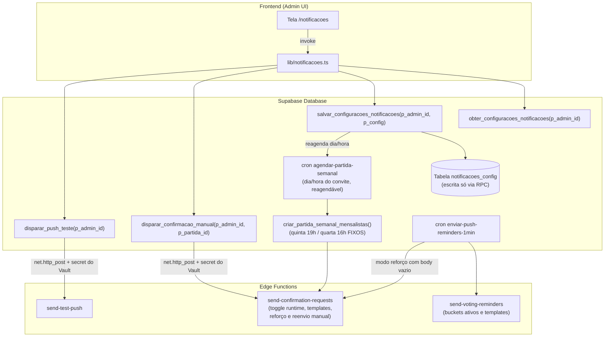

# Plano de Implementação: Gestão de Notificações Push no Frontend

Permitir que os administradores gerenciem as notificações push do sistema pelo painel do aplicativo (web e mobile): habilitar/desativar fluxos, definir dia e horário do disparo do convite semanal, personalizar títulos e mensagens, além de testar e disparar envios manuais.

> **Regra de domínio fixa**: o jogo é **sempre na quinta 19h BRT** e o prazo de confirmação **sempre na quarta 16h BRT**. Esses valores permanecem hardcoded na RPC `criar_partida_semanal_mensalistas()` (migration 059) e **não** são configuráveis por esta tela.

---

## 1. Visão Geral da Solução

---

## 2. Decisões Consolidadas (Grill-Me + Revisão Técnica)

| Eixo | Decisão Aprovada |
| --- | --- |
| **Escopo** | Confirmações Semanais de Presença (com reforço) + Lembretes de Votação pós-jogo. |
| **Regra de Domínio Fixa** | Jogo **sempre na quinta 19h BRT** e prazo de confirmação **sempre na quarta 16h BRT** — permanecem hardcoded na RPC da migration 059. Nada disso é configurável. |
| **Parâmetros da Confirmação** | Somente **dia/horário do disparo do convite** (reagenda o cron semanal) e **horas de antecedência do reforço**. |
| **Semântica do Toggle `confirmacao_ativo`** | Desliga **somente o push**. A partida semanal continua sendo criada normalmente pelo cron de segunda; a Edge Function lê a flag em runtime e aborta o envio. O job do cron **nunca** é desativado/removido. |
| **Lembretes de Votação** | Toggle global + seleção individual dos buckets (`6h`, `3h`, `1h`, `30m`), lidos em runtime pela Edge Function (cron de 1 min permanece `* * * * *`). |
| **Disparo Manual & Testes** | "Testar no meu dispositivo" + "Reenviar convite agora" (mesma notificação do disparo automático, para os mensalistas ainda **pendentes** da partida draft atual). Ambos executados via RPC intermediária com `net.http_post` — o segredo `push_cron_secret` **nunca** chega ao client. |
| **Localização no App** | Rota **`/notificacoes`**, seguindo o padrão atual do projeto: sem prefixo `/admin`, protegida por guard interno com `useAdmin()` (como `Administrador.tsx`), com atalho no menu dropdown de Admin do cabeçalho. |
| **Personalização de Textos** | Título e Mensagem editáveis para cada tipo de notificação, com interpolação de `{dia_jogo}`, `{hora_jogo}`, `{prazo}` lidos da própria partida (`data_jogo`, `confirmacao_closes_at`). |

---

## 3. Modificações Propostas

### 3.1. Banco de Dados (Supabase Migration)

#### [NEW] [`074_configuracoes_notificacoes.sql`](file:///c:/GIT/racha/supabase/migrations/074_configuracoes_notificacoes.sql)

> ⚠️ Numeração: o slot "068" do rascunho original já está ocupado (`068_rpc_salvar_edicao_partida.sql`); a sequência real vai até `073`. A próxima migration é a **074** (padrão de 3 dígitos, §7.2 do AGENTS.md).

1. **Criação da tabela `notificacoes_config`** (singleton `id integer PRIMARY KEY = 1` — Zero UUID, §7.1):
   - **Confirmação de Presença**:
     - `confirmacao_ativo` (boolean, default `true`) — desliga **só o push**, nunca a criação da partida.
     - `confirmacao_dia_semana` (smallint, default `1`) — **CHECK entre 1 e 3** (seg/ter/qua): o convite precisa sair antes do prazo fixo de quarta 16h.
     - `confirmacao_horario` (time, default `'10:00'`) — **CHECK `< '21:00'`** (garante que a conversão BRT→UTC não transborda para o dia seguinte).
     - `confirmacao_titulo`, `confirmacao_mensagem` (text, nullable — NULL = fallback hardcoded na Edge Function).
   - **Reforço de Confirmação (2º Lembrete)**:
     - `reforco_ativo` (boolean, default `true`).
     - `reforco_horas_antes_prazo` (smallint, default `4`) — CHECK entre 1 e 48.
     - `reforco_titulo`, `reforco_mensagem` (text, nullable).
   - **Lembretes de Votação**:
     - `votacao_ativo` (boolean, default `true`).
     - `votacao_bucket_6h` / `_3h` / `_1h` / `_30m` (boolean, default `true`).
     - `votacao_template_6h_titulo`, `votacao_template_6h_msg` (idem `3h`, `1h`, `30m`) — nullable com fallback.
   - `updated_at` (timestamptz default `now()`), `updated_by` (bigint REFERENCES `jogadores(id)`).
2. **Trava de escrita direta**: `REVOKE ALL ON notificacoes_config FROM anon, authenticated;` — client só lê/escreve via RPC; a Edge Function usa service role, que não é afetada (mesmo espírito da migration 069 do `senha_hash`).
3. **RPC `obter_configuracoes_notificacoes(p_admin_id bigint)`** `RETURNS jsonb`, **STABLE**, `SECURITY DEFINER SET search_path = public`: valida `is_admin` do `p_admin_id` e devolve a linha singleton (padrão das RPCs admin do projeto).
4. **RPC `salvar_configuracoes_notificacoes(p_admin_id bigint, p_config jsonb)`** `RETURNS boolean`:
   - Valida `is_admin = true`; atualiza somente as chaves whitelistadas do `p_config`; grava `updated_at`/`updated_by`.
   - **Reagenda o job `agendar-partida-semanal`** sempre que dia/horário do convite mudarem: conversão BRT→UTC (hora UTC = hora BRT + 3, ex: terça 09:00 BRT → `0 12 * * 2`), padrão `unschedule-if-exists → cron.schedule` reutilizando o **mesmo bloco `DO`** da migration 060 (cria a partida **e** posta a Edge Function). O toggle `confirmacao_ativo` **não** mexe no job.
5. **RPC `disparar_confirmacao_manual(p_admin_id bigint, p_partida_id bigint)`** `RETURNS boolean`:
   - Valida admin e que a partida existe com `status = 'draft'`.
   - `net.http_post` → `send-confirmation-requests` com body `{"partida_id": X, "reenviar": true}` e header `x-push-cron-secret` lido do Vault (padrão da migration 060). O `pg_net` é assíncrono: o retorno indica **enfileiramento**, não entrega.
6. **RPC `disparar_push_teste(p_admin_id bigint)`** `RETURNS boolean`: valida admin e posta `send-test-push` com body `{"jogador_id": p_admin_id}` (mesmo padrão de secret).
7. **Relax do CHECK do ledger** `push_reminder_deliveries` (padrão da migration 057): `reminder_key IN ('6h','3h','1h','30m','confirmacao','reforco')`.
8. **Reagenda o job de 1 min**: `unschedule('enviar-lembretes-votacao-1min')` → `schedule('enviar-push-reminders-1min', '* * * * *')` postando para as **duas** Edge Functions (`send-voting-reminders` body `{}` e `send-confirmation-requests` body `{}` = modo reforço automático).
9. **`GRANT EXECUTE`** explícito das 4 RPCs para `anon, authenticated` e **sincronização do `supabase/aplicar_tudo.sql`** (§7.2 — obrigatório).

#### [UNCHANGED] `criar_partida_semanal_mensalistas()` (migration 059)

Permanece **intacta**: quinta 19h e quarta 16h hardcoded. Como o dia do jogo não é configurável, não há risco de idempotência quebrando na fronteira de semana ISO.

---

### 3.2. Edge Functions

#### [MODIFY] [`supabase/functions/send-confirmation-requests/index.ts`](file:///c:/GIT/racha/supabase/functions/send-confirmation-requests/index.ts)

Ao acordar, lê `notificacoes_config` (service role) e suporta **três modos** pelo body:

1. **`{"partida_id": X}`** (cron semanal, migration 060 — comportamento atual): envia aos mensalistas pendentes, idempotente via ledger `reminder_key = 'confirmacao'`. **Se `confirmacao_ativo = false`, responde 200 sem enviar** (a partida já foi criada; apenas o push é suprimido).
2. **`{}`** (job de 1 min — modo reforço automático): se `reforco_ativo`, localiza a partida `draft` cujo `confirmacao_closes_at` esteja dentro da janela `[prazo − reforco_horas_antes_prazo, prazo)` e envia aos pendentes com `reminder_key = 'reforco'` (idempotência pela PK do ledger, análoga aos buckets de votação).
3. **`{"partida_id": X, "reenviar": true}`** (RPC manual): dispara **a mesma notificação do disparo automático** para os ainda **pendentes**, ignorando a janela do reforço. Antes de enviar, apaga o ledger `'reforco'` daqueles alvos — cliques repetidos reenviam corretamente. Disparo pontual explícito do admin: vale mesmo com `confirmacao_ativo = false`.

Comum a todos: templates `confirmacao_titulo`/`confirmacao_mensagem` com fallback para os textos atuais; interpolação de `{dia_jogo}`, `{hora_jogo}`, `{prazo}` lidos de `partidas.data_jogo` / `confirmacao_closes_at` formatados em pt-BR.

#### [MODIFY] [`supabase/functions/send-voting-reminders/index.ts`](file:///c:/GIT/racha/supabase/functions/send-voting-reminders/index.ts)

- Lê `notificacoes_config`: se `votacao_ativo = false`, responde 200 sem enviar.
- Buckets desativados (`votacao_bucket_6h` etc.) ficam fora da seleção — o job de 1 min permanece `* * * * *`, decisão tomada em runtime.
- Templates por bucket com fallback nos textos hardcoded atuais.

---

### 3.3. Frontend (React + Tailwind)

#### [NEW] [`src/lib/notificacoes.ts`](file:///c:/GIT/racha/src/lib/notificacoes.ts)

- Tipo `NotificacoesConfig` espelhando a linha singleton.
- Funções via `supabase.rpc(...)`, todas passando o id do admin para validação no banco:
  - `obterConfiguracoesNotificacoes(adminId)`
  - `salvarConfiguracoesNotificacoes(adminId, config)`
  - `dispararPushTeste(adminId)`
  - `dispararConfirmacaoManual(adminId, partidaId)`
- **Nenhum `fetch` direto às Edge Functions** (o segredo `push_cron_secret` vive só no Vault/servidor). Erros sempre via `formatarMensagemErro` de `src/lib/erros.ts`.

#### [NEW] [`src/routes/Notificacoes.tsx`](file:///c:/GIT/racha/src/routes/Notificacoes.tsx)

- **Guard interno padrão do projeto**: todos os hooks no topo e `if (!isAdmin) return <Navigate to="/" replace />;` no final — espelha `Administrador.tsx` (não existe proteção declarativa em `App.tsx`).
- Carregamento via `useEffect` assíncrono com flag `let ativo = true` no cleanup (§5.2 do AGENTS.md; tela de edição de config não usa `useCache` para não servir stale durante a edição).
- Estética conforme `design-system.md`: tokens semânticos, cantos `rounded-[4px]`, `shadow-carimbo`, `font-display uppercase` em títulos, inputs `text-base` com `focus-visible:outline-destaque`, alvos ≥ 44px.
- Seções:
  1. **Confirmação de Presença Semanal**: toggle Liga/Desliga (com legenda "desliga apenas o aviso; a partida continua sendo criada"); dia (seg/ter/qua) e horário do convite; campos de Título e Mensagem com legenda das variáveis (`{dia_jogo}`, `{hora_jogo}`, `{prazo}`); reforço (toggle + horas antes do prazo + textos).
  2. **Lembretes de Votação Pós-Jogo**: toggle global; checkboxes dos buckets (`6h`, `3h`, `1h`, `30m`); acordeão com textos por bucket.
  3. **Ações**: "Testar no meu dispositivo" (feedback de **enfileirado** — `pg_net` é assíncrono) e "Reenviar convite agora" para a partida `draft` da semana atual, com `<ConfirmDialog>` antes do disparo.
  4. Barra fixa "Salvar Alterações" com `vibrateSuccess`/`vibrateError` e `<Snackbar>` de sucesso/erro.

#### [MODIFY] [`src/lib/rotas.ts`](file:///c:/GIT/racha/src/lib/rotas.ts)

- Adicionar `carregarNotificacoes` + export `Notificacoes` — fonte única dos imports dinâmicos de rotas (§6.7; proibido declarar `import('../routes/...')` fora dali).

#### [MODIFY] [`src/App.tsx`](file:///c:/GIT/racha/src/App.tsx)

- `<Route path="/notificacoes" element={<Notificacoes />} />` dentro do `Layout`, importando de `lib/rotas`.

#### [MODIFY] [`src/components/Skeletons.tsx`](file:///c:/GIT/racha/src/components/Skeletons.tsx) + [`src/routes/Layout.tsx`](file:///c:/GIT/racha/src/routes/Layout.tsx)

- `SkeletonNotificacoes` espelhando a estrutura da tela + entrada `{ padrao: /^\/notificacoes/, ... }` no mapa `SKELETONS_POR_ROTA` (CLS = 0, §5.4).
- Opção **"Notificações"** (ícone `Bell`) no menu dropdown de Admin do cabeçalho.

---

## 4. Plano de Verificação

### Conformidade com o AGENTS.md (checklist §11.2)

- [ ] `npm run lint` com 0 erros, `npm run format` e `npm run build` sem falhas.
- [ ] Migration **074** (sequencial 3 dígitos); zero UUID; RPCs com `SECURITY DEFINER`, `SET search_path = public` e `GRANT EXECUTE` explícito.
- [ ] `REVOKE ALL ON notificacoes_config FROM anon, authenticated` — escrita/leitura só via RPC.
- [ ] `supabase/aplicar_tudo.sql` sincronizado com a 074.
- [ ] Design: tokens semânticos, cantos 4px, `shadow-carimbo`, `font-display`/`font-mono`; sem `window.confirm`/`alert`; botão voltar com `voltar(navigate, fallback)`; alvos ≥ 44px.

### Testes Automatizados & Build

- Executar `npm run build` para garantir conformidade de tipos TypeScript, JSX e empacotamento Vite.
- Validar a sintaxe SQL da migration (aplicar em banco limpo via `aplicar_tudo.sql`).

### Verificação Manual

1. **Acesso e Navegação**:
   - Não-admin acessando `/notificacoes` → redirecionado para `/`.
   - Admin: dropdown ADMIN → "Notificações" → tela carrega com skeleton e valores atuais.
2. **Semântica do toggle (crítico)**:
   - Desligar "Confirmação de Presença" e salvar.
   - Na segunda, verificar que a partida `draft` **é criada normalmente** (regra do domínio intacta) e que **nenhum push sai** (sem linhas novas com `reminder_key='confirmacao'`).
3. **Agendamento no banco**:
   - Mudar o convite para terça 09:00 → conferir em `cron.job` a expressão `0 12 * * 2` para `agendar-partida-semanal` (BRT+3).
   - Conferir o novo job `enviar-push-reminders-1min` (`* * * * *`) e a ausência do antigo `enviar-lembretes-votacao-1min`.
4. **Reenvio manual (caso da terça-feira)**:
   - Na terça, clicar "Reenviar convite agora" → push chega aos mensalistas **pendentes** (com template custom e variáveis interpoladas).
   - Clicar de novo → reenvia (ledger `'reforco'` limpo antes do disparo).
5. **Reforço automático**:
   - Com `reforco_horas_antes_prazo = 4`, dentro da janela (quarta 12h) o job de 1 min dispara **uma única vez** (idempotência pelo ledger `'reforco'`).
6. **Votação**:
   - Desmarcar o bucket 30m → notificações de votação saem em 6h/3h/1h, mas não em 30m; desligar `votacao_ativo` → nenhuma sai.
7. **Teste no dispositivo**:
   - "Testar no meu dispositivo" → Snackbar de disparo enfileirado e push chegando ao PWA instalado.
8. **Persistência**:
   - Salvar, recarregar a página e confirmar que todos os valores persistiram.
