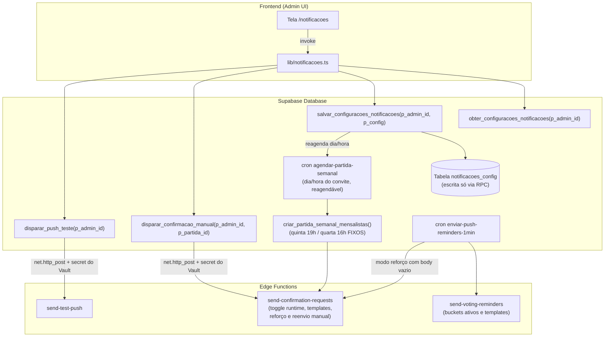

# Plano de Implementação: Gestão de Notificações Push no Frontend

Permitir que os administradores gerenciem as notificações push do sistema pelo painel do aplicativo (web e mobile): habilitar/desativar fluxos, definir dia e horário do disparo do convite semanal, personalizar títulos e mensagens, além de testar e disparar envios manuais.

> **Regra de domínio fixa**: o jogo é **sempre na quinta 19h BRT** e o prazo de confirmação **sempre na quarta 16h BRT**. Esses valores permanecem hardcoded na RPC `criar_partida_semanal_mensalistas()` (migration 059) e **não** são configuráveis por esta tela.

---

## 1. Visão Geral da Solução

---

## 2. Decisões Consolidadas (Grill-Me + Revisão Técnica)

| Eixo | Decisão Aprovada |
| --- | --- |
| **Escopo** | Confirmações Semanais de Presença (com reforço) + Lembretes de Votação pós-jogo. |
| **Regra de Domínio Fixa** | Jogo **sempre na quinta 19h BRT** e prazo de confirmação **sempre na quarta 16h BRT** — permanecem hardcoded na RPC da migration 059. Nada disso é configurável. |
| **Parâmetros da Confirmação** | Somente **dia/horário do disparo do convite** (reagenda o cron semanal) e **horas de antecedência do reforço**. |
| **Semântica do Toggle `confirmacao_ativo`** | Desliga **somente o push**. A partida semanal continua sendo criada normalmente pelo cron de segunda; a Edge Function lê a flag em runtime e aborta o envio. O job do cron **nunca** é desativado/removido. Rege **apenas o convite semanal**: o reforço tem toggle próprio (`reforco_ativo`) e os dois são **independentes** — cada um suprime somente o seu próprio push. |
| **Lembretes de Votação** | Toggle global + seleção individual dos buckets (`6h`, `3h`, `1h`, `30m`), lidos em runtime pela Edge Function (cron de 1 min permanece `* * * * *`). |
| **Disparo Manual & Testes** | "Testar no meu dispositivo" + "Reenviar convite agora" (mesma notificação do disparo automático, para os mensalistas ainda **pendentes** da partida draft atual). Ambos executados via RPC intermediária com `net.http_post` — o segredo `push_cron_secret` **nunca** chega ao client. O reenvio manual é **ação explícita do admin: sempre liberado**, mesmo com `confirmacao_ativo = false` e/ou `reforco_ativo = false`. |
| **Resolução da Partida Atual** | A partida "atual" é o **maior `partida_id`** com `status = 'draft'` (criada na segunda pelo cron; permanece `draft` até o jogo na quinta). Resolvida no client via query direta em `lib/notificacoes.ts`; sem draft → ação de reenvio desabilitada com estado vazio explicando. |
| **Reenvio Manual × Ledger** | O modo manual **não consulta nem escreve** `push_reminder_deliveries`: cliques repetidos reenviam sempre (a proteção contra disparo acidental é o `<ConfirmDialog>` no client). O ledger permanece registro exclusivo dos fluxos automáticos (idempotência/auditoria). |
| **Localização no App** | Rota **`/notificacoes`**, seguindo o padrão atual do projeto: sem prefixo `/admin`, protegida por guard interno com `useAdmin()` (como `Administrador.tsx`), com atalho no menu dropdown de Admin do cabeçalho. |
| **Personalização de Textos** | Título e Mensagem editáveis para cada tipo de notificação, com interpolação de `{dia_jogo}`, `{hora_jogo}`, `{prazo}` lidos da própria partida (`data_jogo`, `confirmacao_closes_at`). |

---

## 3. Modificações Propostas

### 3.1. Banco de Dados (Supabase Migration)

#### [NEW] [`075_configuracoes_notificacoes.sql`](file:///c:/GIT/racha/supabase/migrations/075_configuracoes_notificacoes.sql)

> ⚠️ Numeração: a sequência real de migrations vai até `074` (`074_isencao_dividas_goleiros.sql`). A próxima migration é a **075** (padrão de 3 dígitos, §7.2 do AGENTS.md).

1. **Criação da tabela `notificacoes_config`** (singleton `id integer PRIMARY KEY = 1` — Zero UUID, §7.1):
   - **Confirmação de Presença**:
     - `confirmacao_ativo` (boolean, default `true`) — desliga **só o push**, nunca a criação da partida.
     - `confirmacao_dia_semana` (smallint, default `1`) — **CHECK entre 1 e 3** (seg/ter/qua): o convite precisa sair antes do prazo fixo de quarta 16h.
     - `confirmacao_horario` (time, default `'10:00'`) — **CHECK `< '21:00'`** (garante que a conversão BRT→UTC não transborda para o dia seguinte).
     - **CHECK composto dia × horário**: `(confirmacao_dia_semana < 3 OR confirmacao_horario < time '16:00')` — quarta-feira só aceita convite **antes** do prazo fixo de 16h BRT (senão o convite sairia após o deadline).
     - `confirmacao_titulo`, `confirmacao_mensagem` (text, nullable — NULL = fallback hardcoded na Edge Function).
   - Todos os campos de template (títulos e mensagens, de confirmação, reforço e votação) recebem `CHECK (char_length(col) <= 120)` para títulos e `CHECK (char_length(col) <= 500)` para mensagens — evita colagem de texto gigante num payload de push.
   - **Reforço de Confirmação (2º Lembrete)**:
     - `reforco_ativo` (boolean, default `true`).
     - `reforco_horas_antes_prazo` (smallint, default `4`) — CHECK entre 1 e 48.
     - `reforco_titulo`, `reforco_mensagem` (text, nullable).
   - **Lembretes de Votação**:
     - `votacao_ativo` (boolean, default `true`).
     - `votacao_bucket_6h` / `_3h` / `_1h` / `_30m` (boolean, default `true`).
     - `votacao_template_6h_titulo`, `votacao_template_6h_msg` (idem `3h`, `1h`, `30m`) — nullable com fallback.
   - `updated_at` (timestamptz default `now()`), `updated_by` (bigint REFERENCES `jogadores(id)`).
   - **Seed obrigatório**: `INSERT INTO notificacoes_config (id) VALUES (1) ON CONFLICT (id) DO NOTHING;` — todas as colunas têm DEFAULT; sem a linha singleton a RPC de leitura retornaria nulo e a Edge Function cairia sempre no fallback.
2. **Trava de escrita direta**: `REVOKE ALL ON notificacoes_config FROM anon, authenticated;` **+ `GRANT SELECT ON notificacoes_config TO service_role;`** (padrão já usado nas tabelas de push do `aplicar_tudo.sql`) — client só lê/escreve via RPC; a Edge Function lê a config com service role explícito (mesmo espírito da migration 069 do `senha_hash`).
3. **RPC `obter_configuracoes_notificacoes(p_admin_id bigint)`** `RETURNS jsonb`, **STABLE**, `SECURITY DEFINER SET search_path = public`: valida `is_admin` do `p_admin_id` e devolve a linha singleton (padrão das RPCs admin do projeto). Se a linha não existir (edge case), retorna NULL — o client assume os defaults locais do tipo.
4. **RPC `salvar_configuracoes_notificacoes(p_admin_id bigint, p_config jsonb)`** `RETURNS boolean`:
   - Valida `is_admin = true`; atualiza somente as chaves whitelistadas do `p_config`; grava `updated_at`/`updated_by`.
   - **Reagenda o job `agendar-partida-semanal`** sempre que dia/horário do convite mudarem: conversão robusta BRT→UTC extraindo minutos e horas (`v_minuto := EXTRACT(MINUTE FROM v_horario)::integer; v_hora_utc := (EXTRACT(HOUR FROM v_horario)::integer + 3) % 24; v_cron_expr := format('%s %s * * %s', v_minuto, v_hora_utc, v_dia_semana);`, ex: terça 09:30 BRT → `30 12 * * 2`), padrão `unschedule-if-exists → cron.schedule` reutilizando o **mesmo bloco `DO`** da migration 060 (cria a partida **e** posta a Edge Function). O toggle `confirmacao_ativo` **não** mexe no job.
   - Como a RPC roda com `SET search_path = public`, as chamadas a `cron.unschedule`/`cron.schedule` e a leitura de `vault.decrypted_secrets` permanecem **schema-qualificadas** (`cron.schedule(...)`, `vault.decrypted_secrets`) — sem isso o Postgres não resolve os objetos das extensões.
5. **RPC `disparar_confirmacao_manual(p_admin_id bigint, p_partida_id bigint)`** `RETURNS boolean`:
   - Valida admin e que a partida existe com `status = 'draft'`.
   - Disparo **incondicional**: as flags `confirmacao_ativo`/`reforco_ativo` **não** são consultadas — ação manual do admin vale sempre.
   - `net.http_post` → `send-confirmation-requests` com body `{"partida_id": X, "reenviar": true}` e header `x-push-cron-secret` lido do Vault (padrão da migration 060). O `pg_net` é assíncrono: o retorno indica **enfileiramento**, não entrega.
6. **RPC `disparar_push_teste(p_admin_id bigint)`** `RETURNS boolean`: valida admin e posta `send-test-push` com body `{"jogador_id": p_admin_id}` (mesmo padrão de secret).
7. **Relax do CHECK do ledger** `push_reminder_deliveries`: acrescenta `'reforco'` **preservando o padrão completo** da migration 057 — incluindo a alternativa regex de slots `HH:MM` (herdada da era 045 e presente no histórico de auditoria) — para o `ALTER` não falhar em banco com linhas antigas nem restringir à toa:
   `CHECK (reminder_key IN ('6h','3h','1h','30m','confirmacao','reforco') OR reminder_key ~ '^([01][0-9]|2[0-3]):(00|15|30|45)$')`.
8. **Reagenda o job de 1 min**: `unschedule` **defensivo dos dois nomes legados** — `enviar-lembretes-votacao-1min` e `enviar-lembretes-votacao-15min` (a cadeia 040→043→045 passou por renomeações e há ambiguidade sobre qual existe hoje na produção; ambos com guard `IF EXISTS` sobre `cron.job`, padrão 043/045) — e então `schedule('enviar-push-reminders-1min', '* * * * *')` postando para as **duas** Edge Functions (`send-voting-reminders` body `{}` e `send-confirmation-requests` body `{}` = modo reforço automático).
9. **`GRANT EXECUTE`** explícito das 4 RPCs para `anon, authenticated` e **sincronização do `supabase/aplicar_tudo.sql`** (§7.2 — obrigatório). O grant inclui `anon` porque o app usa login próprio (`fazer_login`) sem Supabase Auth — todas as chamadas do client chegam como `anon`; o gate é a validação `is_admin` **dentro** da RPC (mesmo modelo de `excluir_partida`/`quitar_divida`).

#### [UNCHANGED] `criar_partida_semanal_mensalistas()` (migration 059)

Permanece **intacta**: quinta 19h e quarta 16h hardcoded. Como o dia do jogo não é configurável, não há risco de idempotência quebrando na fronteira de semana ISO.

---

### 3.2. Edge Functions

#### [MODIFY] [`supabase/functions/send-confirmation-requests/index.ts`](file:///c:/GIT/racha/supabase/functions/send-confirmation-requests/index.ts)

Ao acordar, lê `notificacoes_config` (service role) e suporta **três modos** pelo body:

1. **`{"partida_id": X}`** (cron semanal, migration 060 — comportamento atual): envia aos mensalistas pendentes, idempotente via ledger `reminder_key = 'confirmacao'`. **Se `confirmacao_ativo = false`, responde 200 sem enviar** (a partida já foi criada; apenas o push é suprimido).
2. **`{}`** (job de 1 min — modo reforço automático): se `reforco_ativo` (independente de `confirmacao_ativo` — cada toggle rege somente o seu próprio push), localiza a partida `draft` atual (**maior `partida_id`** em `draft`) cujo `confirmacao_closes_at` esteja dentro da janela `[prazo − reforco_horas_antes_prazo, prazo)` e envia aos pendentes com `reminder_key = 'reforco'` (idempotência pela PK do ledger, análoga aos buckets de votação).
3. **`{"partida_id": X, "reenviar": true}`** (RPC manual): dispara **a mesma notificação do disparo automático** para os ainda **pendentes**. **Disparo incondicional do admin**: ignora `confirmacao_ativo`, `reforco_ativo` e a janela do reforço, e **não consulta nem escreve o ledger** — cliques repetidos reenviam sempre (a proteção contra disparo acidental é o `<ConfirmDialog>` no client). O ledger permanece registro exclusivo dos fluxos automáticos.

Comum a todos: templates `confirmacao_titulo`/`confirmacao_mensagem` com fallback para os textos atuais; interpolação de `{dia_jogo}`, `{hora_jogo}`, `{prazo}` lidos de `partidas.data_jogo` / `confirmacao_closes_at` formatados explicitamente no fuso de Brasília (`timeZone: 'America/Sao_Paulo'`) via `Intl.DateTimeFormat` em pt-BR.

#### [MODIFY] [`supabase/functions/send-voting-reminders/index.ts`](file:///c:/GIT/racha/supabase/functions/send-voting-reminders/index.ts)

- Lê `notificacoes_config`: se `votacao_ativo = false`, responde 200 sem enviar.
- Buckets desativados (`votacao_bucket_6h` etc.) ficam fora da seleção — o job de 1 min permanece `* * * * *`, decisão tomada em runtime.
- Templates por bucket com fallback nos textos hardcoded atuais.

---

### 3.3. Frontend (React + Tailwind)

#### [NEW] [`src/lib/notificacoes.ts`](file:///c:/GIT/racha/src/lib/notificacoes.ts)

- Tipo `NotificacoesConfig` espelhando a linha singleton.
- Funções via `supabase.rpc(...)`, todas passando o id do admin para validação no banco:
  - `obterConfiguracoesNotificacoes(adminId)`
  - `salvarConfiguracoesNotificacoes(adminId, config)`
  - `dispararPushTeste(adminId)`
  - `dispararConfirmacaoManual(adminId, partidaId)`
  - `obterPartidaDraftAtual()` — leitura direta (partidas é pública pelos grants baseline): `from('partidas').select('id, data_jogo, confirmacao_closes_at').eq('status', 'draft').order('id', { ascending: false }).limit(1).maybeSingle()`. Regra: **a partida atual é o maior `partida_id` em `draft`** (criada na segunda; permanece `draft` até o jogo na quinta).
- **Nenhum `fetch` direto às Edge Functions** (o segredo `push_cron_secret` vive só no Vault/servidor). Erros sempre via `formatarMensagemErro` de `src/lib/erros.ts`.

#### [NEW] [`src/routes/Notificacoes.tsx`](file:///c:/GIT/racha/src/routes/Notificacoes.tsx)

- **Guard interno padrão do projeto**: todos os hooks no topo e `if (!isAdmin) return <Navigate to="/" replace />;` no final — espelha `Administrador.tsx` (não existe proteção declarativa em `App.tsx`).
- Carregamento via `useEffect` assíncrono com flag `let ativo = true` no cleanup (§5.2 do AGENTS.md; tela de edição de config não usa `useCache` para não servir stale durante a edição).
- Estética conforme `design-system.md`: tokens semânticos, cantos `rounded-[4px]`, `shadow-carimbo`, `font-display uppercase` em títulos, inputs `text-base` com `focus-visible:outline-destaque`, alvos ≥ 44px.
- Seções:
  1. **Confirmação de Presença Semanal**: toggle Liga/Desliga (com legenda "desliga apenas o aviso; a partida continua sendo criada"); dia (seg/ter/qua) e horário do convite; campos de Título e Mensagem com legenda das variáveis (`{dia_jogo}`, `{hora_jogo}`, `{prazo}`); reforço (toggle + horas antes do prazo + textos).
  2. **Lembretes de Votação Pós-Jogo**: toggle global; checkboxes dos buckets (`6h`, `3h`, `1h`, `30m`); acordeão com textos por bucket.
  3. **Ações**:
     - "Testar no meu dispositivo" com checagem local de permissão: se `Notification.permission !== 'granted'`, exibe banner orientativo de alerta ("Ative as notificações neste dispositivo para receber o teste") antes de acionar o disparo. Feedback de **enfileirado** (`pg_net` é assíncrono).
     - "Reenviar convite agora" para a **partida `draft` atual (maior `partida_id` em `draft`)** — o cartão exibe o alvo (nº da partida e data do jogo), com `<ConfirmDialog>` antes do disparo. O reenvio é **ação manual do admin e está sempre liberado**, mesmo com os toggles desligados. Sem partida em `draft` (ex.: jogo já `live` na quinta) → botão desabilitado com legenda "Nenhuma partida agendada — o convite semanal cria a partida na segunda".
  4. **Salvar Alterações**: Botão posicionado no fluxo normal do formulário (**inline** no rodapé do conteúdo, seguindo o padrão de `Administrador.tsx`, com espaçamento generoso e padding confortável, sem risco de sobreposição à TabBar inferior), com `vibrateSuccess`/`vibrateError` e `<Snackbar>` de feedback.

#### [MODIFY] [`src/lib/rotas.ts`](file:///c:/GIT/racha/src/lib/rotas.ts)

- Adicionar `carregarNotificacoes` + export `Notificacoes` — fonte única dos imports dinâmicos de rotas (§6.7; proibido declarar `import('../routes/...')` fora dali).

#### [MODIFY] [`src/App.tsx`](file:///c:/GIT/racha/src/App.tsx)

- `<Route path="/notificacoes" element={<Notificacoes />} />` dentro do `Layout`, importando de `lib/rotas`.

#### [MODIFY] [`src/components/Skeletons.tsx`](file:///c:/GIT/racha/src/components/Skeletons.tsx) + [`src/routes/Layout.tsx`](file:///c:/GIT/racha/src/routes/Layout.tsx)

- `SkeletonNotificacoes` espelhando a estrutura da tela + entrada `{ padrao: /^\/notificacoes/, ... }` no mapa `SKELETONS_POR_ROTA` (CLS = 0, §5.4).
- Opção **"Notificações"** (ícone `Bell`) no menu dropdown de Admin do cabeçalho.

---

## 4. Plano de Verificação

### Conformidade com o AGENTS.md (checklist §11.2)

- [ ] `npm run lint` com 0 erros, `npm run format` e `npm run build` sem falhas.
- [ ] Migration **075** (sequencial 3 dígitos); zero UUID; RPCs com `SECURITY DEFINER`, `SET search_path = public` e `GRANT EXECUTE` explícito.
- [ ] `REVOKE ALL ON notificacoes_config FROM anon, authenticated` + `GRANT SELECT ... TO service_role` — escrita/leitura só via RPC; Edge Function lê com service role.
- [ ] Seed da linha singleton (`INSERT ... ON CONFLICT DO NOTHING`) presente na 075 e no `aplicar_tudo.sql`.
- [ ] CHECK do `reminder_key` preserva a alternativa regex `HH:MM` do histórico (era 045) além de `'reforco'`.
- [ ] CHECK composto dia × horário: quarta (`dia_semana = 3`) rejeita horário `>= '16:00'`.
- [ ] Checks de `char_length` nos campos de template (títulos ≤ 120, mensagens ≤ 500).
- [ ] `supabase/aplicar_tudo.sql` sincronizado com a 075.
- [ ] Design: tokens semânticos, cantos 4px, `shadow-carimbo`, `font-display`/`font-mono`; sem `window.confirm`/`alert`; botão voltar com `voltar(navigate, fallback)`; alvos ≥ 44px; botão Salvar inline no final do form.

### Testes Automatizados & Build

- Executar `npm run build` para garantir conformidade de tipos TypeScript, JSX e empacotamento Vite.
- Validar a sintaxe SQL da migration (aplicar em banco limpo via `aplicar_tudo.sql`).

### Verificação Manual

1. **Acesso e Navegação**:
   - Não-admin acessando `/notificacoes` → redirecionado para `/`.
   - Admin: dropdown ADMIN → "Notificações" → tela carrega com skeleton e valores atuais.
2. **Semântica do toggle (crítico)**:
   - Desligar "Confirmação de Presença" e salvar.
   - Na segunda, verificar que a partida `draft` **é criada normalmente** (regra do domínio intacta) e que **nenhum push sai** (sem linhas novas com `reminder_key='confirmacao'`).
   - Com `confirmacao_ativo = false` e `reforco_ativo = true`: o reforço automático da quarta **continua saindo** (toggles independentes — cada um suprime só o seu push).
3. **Agendamento no banco**:
   - Mudar o convite para terça 09:30 → conferir em `cron.job` a expressão `30 12 * * 2` para `agendar-partida-semanal` (BRT+3).
   - **Antes do deploy**, inspecionar `SELECT jobname, schedule FROM cron.job ORDER BY jobname;` para registrar qual job legado existia; após, conferir o novo job `enviar-push-reminders-1min` (`* * * * *`) e a ausência **tanto** de `enviar-lembretes-votacao-1min` **quanto** de `enviar-lembretes-votacao-15min`.
4. **Reenvio manual (caso da terça-feira)**:
   - Na terça, clicar "Reenviar convite agora" → push chega aos mensalistas **pendentes** (com template custom e variáveis interpoladas no fuso de Brasília).
   - Clicar de novo → reenvia (modo manual não consulta o ledger).
   - Com `confirmacao_ativo = false` e `reforco_ativo = false`: o botão permanece liberado e o push sai (disparo manual é incondicional).
   - Com dois drafts coexistindo (automática + manual criada pelo admin): o alvo é o **maior `partida_id`**.
   - Sem partida em `draft` (jogo já `live`/`published`) → botão desabilitado com estado vazio.
5. **Reforço automático**:
   - Com `reforco_horas_antes_prazo = 4`, dentro da janela (quarta 12h) o job de 1 min dispara **uma única vez** (idempotência pelo ledger `'reforco'`).
6. **Votação**:
   - Desmarcar o bucket 30m → notificações de votação saem em 6h/3h/1h, mas não em 30m; desligar `votacao_ativo` → nenhuma sai.
7. **Teste no dispositivo**:
   - "Testar no meu dispositivo" → se permissão não concedida, banner orienta ativação; caso concedida, Snackbar de disparo enfileirado e push chegando ao PWA instalado.
8. **Persistência e Layout**:
   - Salvar via botão inline no rodapé do formulário, recarregar a página e confirmar que todos os valores persistiram sem que a TabBar tenha ocultado o botão ou gerado conflito de visualização.
