# 📋 Plano de Implementação: P1-4 — Componentes Gigantes com Responsabilidade Misturada

> **Item da Auditoria**: `P1-4` de [`docs/plano-refatoracoes.md`](./plano-refatoracoes.md)
> **Status**: Proposto — **Rev. 2, reauditado contra o código** no commit `d7ec74a` (28/08/2026)
> **Fontes Canônicas**: [`AGENTS.md`](../AGENTS.md) e [`design-system.md`](../design-system.md)
> **Escopo**: `src/routes/PartidaDetalhe.tsx`, `src/routes/Administrador.tsx`, `src/routes/Notificacoes.tsx`, `src/routes/GestaoJogadores.tsx`, `src/routes/PartidaEditar.tsx`, `src/components/EventosAutomaticosFinanceiro.tsx`.

---

## 🎯 1. Visão Geral e Racional Arquitetural

Seis arquivos do projeto acumulam de 475 a 817 linhas cada (contagem via `wc -l` no commit `d7ec74a`), misturando coordenação de tela, formulários complexos, listas com ações transacionais, subcomponentes inline e modais inteiros no mesmo arquivo. Dois deles já têm subcomponentes inline prontos para extração (`Confirmacoes`/`BotoesSelf`/`BotoesAdmin` em `PartidaDetalhe`; `StepperBox` em `PartidaEditar`).

> **Fronteira de escopo**: `Comparador.tsx` (554), `Ranking.tsx` (530), `EscalacaoTimesEditor.tsx` (520) e `GestaoGoleiros.tsx` (469) também estão na faixa de 450–560 linhas, mas ficam **fora** deste item — o P1-4 da auditoria delimitou estes seis arquivos. Se desejado, viram item próprio no [`docs/plano-refatoracoes.md`](./plano-refatoracoes.md).

### 🚫 Problemas Identificados (verificados no código atual):

1. **Dificuldade de Manutenção e Auditoria**: arquivos massivos com até 18 `useState` (`Administrador.tsx`) dificultam a leitura de fluxo e violam a responsabilidade única.
2. **Re-renderizações Excessivas**: estado de UI pura vive na rota e re-renderiza a árvore inteira a cada interação local (ex.: `expandido` em `Administrador`, `bucketAberto` em `Notificacoes`, campos de formulário em `Administrador`).
3. **Acoplamento de Domínio e UI**: subcomponentes complexos (confirmações de presença, formulário de eventos automáticos) vivem dentro das rotas em vez de módulos focados.

### 🎯 Objetivos da Refatoração:

1. **Transformar as rotas em orquestradoras** (carregamento, estado de servidor, navegação e diálogos), com metas realistas por arquivo (tabela na seção 2).
2. **Extrair 18 componentes especializados** para `src/components/`, com props tipadas estritamente e contratos unidirecionais (dados descem, ações sobem).
3. **Internalizar estado de UI pura nos componentes extraídos** (`expandido`, `bucketAberto`, busca/filtro do modal) — correção direta ao problema nº 2.
4. **Preservar integralmente o comportamento funcional**: mesmas RPCs, mesmo fluxo de otimista/rollback, mesmos textos e classes visuais. Refatoração de movimentação de código, sem mudança de regra de negócio.
5. **Fidelidade estrita a [`AGENTS.md`](../AGENTS.md) e [`design-system.md`](../design-system.md)**: hooks no topo, alvos ≥ 44px, tríade tipográfica, tokens semânticos, `shadow-carimbo`.

### 📌 O que mudou desde a Rev. 1 (plano original de 27/08):

- Contagens atualizadas: o P0-6 (`d7ec74a`) consolidou leituras de votos no lib e `PartidaDetalhe`/`Administrador` encolheram ~10 linhas cada.
- **Metas de linha corrigidas**: as metas da Rev. 1 (~190–240 por arquivo) eram inalcançáveis com as extrações listadas — os componentes extraídos somavam menos linhas do que a redução prometida. As metas agora são honestas e derivadas da medição bloco a bloco (seção 2).
- **Estado de UI internalizado**: `expandido` (Administrador) e `bucketAberto` (Notificações) passam a ser estado local dos componentes extraídos, não props da rota.
- **`Dispatch` de `setState` removido das props**: as seções de notificações recebem `onAlterar(patch)` em vez de `React.Dispatch<SetStateAction<...>>`.
- **2 extrações novas** para fechar a meta da Rev. 1: `ResumoGestao.tsx` e `CartaoJogadorEdicao.tsx`.
- **`EventoFinanceiroAutomaticoPayload` não existia**: será exportado de `src/lib/eventosFinanceirosAutomaticos.ts` (hoje o input de `salvarEventoAutomatico` é um tipo inline).

---

## 📐 2. Matriz de Componentes e Metas por Arquivo

```mermaid
graph TD
    subgraph PartidaDetalhe
        PD[PartidaDetalhe.tsx] --> CP[ConfirmacoesPartida.tsx]
        PD --> CC[CardCraquePartida.tsx]
        PD --> LN[ListaNotasPartida.tsx]
        PD --> GT[GridTimesPartida.tsx]
    end

    subgraph Administrador
        ADM[Administrador.tsx] --> FL[FormLancamentoFinanceiro.tsx]
        ADM --> SE[SecaoExportacaoFinanceira.tsx]
        ADM --> LRA[ListaReceitasAbertas.tsx]
        ADM --> LDA[ListaDespesasAbertas.tsx]
    end

    subgraph Notificacoes
        NOT[Notificacoes.tsx] --> SNC[SecaoNotificacaoConfirmacao.tsx]
        NOT --> SNV[SecaoNotificacaoVotacao.tsx]
        NOT --> SNT[SecaoNotificacaoTestes.tsx]
    end

    subgraph GestaoJogadores
        GJ[GestaoJogadores.tsx] --> RG[ResumoGestao.tsx]
        GJ --> LJG[LinhaJogadorGestao.tsx]
        GJ --> BRG[BarraRascunhoGestao.tsx]
    end

    subgraph PartidaEditar
        PE[PartidaEditar.tsx] --> MEJ[ModalEscalarJogador.tsx]
        PE --> CJE[CartaoJogadorEdicao.tsx]
        CJE --> SB[StepperBox.tsx]
    end

    subgraph EventosAutomaticos
        EAF[EventosAutomaticosFinanceiro.tsx] --> FEA[FormEventoAutomatico.tsx]
    end
```



### Metas de linha (base: `wc -l` no commit `d7ec74a`)

| Arquivo                                           | Hoje | Blocos extraídos (linhas atuais)                                                                                                                                                   | Meta pós-refatoração |
| ------------------------------------------------- | ---- | ---------------------------------------------------------------------------------------------------------------------------------------------------------------------------------- | -------------------- |
| `src/routes/PartidaDetalhe.tsx`                   | 817  | `Confirmacoes`+`BotoesSelf`+`BotoesAdmin` (l.461–817, ~357), card do craque (l.241–268), lista de notas (l.271–298), grid de times (l.310–364)                                     | **≤ 360**            |
| `src/routes/Administrador.tsx`                    | 814  | formulário (l.361–513 + 8 estados + handlers), exportação (l.516–560 + 3 estados + handler), receitas (l.567–700 + `expandido` + cópia WhatsApp), despesas (l.702–798 + cópia PIX) | **≤ 330**            |
| `src/routes/Notificacoes.tsx`                     | 739  | Seção 1 (l.287–481 + 5 constantes de módulo), Seção 2 (l.484–611 + `bucketAberto` + 2 constantes), Seção 3 (l.614–680)                                                             | **≤ 320**            |
| `src/routes/GestaoJogadores.tsx`                  | 730  | banner+cards de resumo (l.314–399), card do jogador (l.465–663, ~199), barra flutuante (l.668–711)                                                                                 | **≤ 420**            |
| `src/routes/PartidaEditar.tsx`                    | 659  | modal `<ModalBase>` inline (l.460–553 + memo `candidatosAdicionar`), card do jogador (l.325–410), `StepperBox` (l.584–659)                                                         | **≤ 400**            |
| `src/components/EventosAutomaticosFinanceiro.tsx` | 475  | formulário (l.250–413) + `FormState`/`formVazio`/`formDeEvento` (l.38–81) + memos e `aoTrocarGatilho`                                                                              | **≤ 240**            |

> ⚠️ **Nota sobre a meta "< 300–350" da Rev. 1**: com a movimentação acima, `GestaoJogadores` e `PartidaEditar` ficam entre 360–420 linhas porque os handlers de mutação de rascunho/lote (`alternarMensalistaDraft`, `alternarAdminDraft`, `salvarTodasAlteracoes`, `ajustar`, `moverTime`, `salvar`) precisam permanecer na rota — eles orquestram estado de servidor e diálogos. Espremer além disso exigiria quebrar o contrato "dados descem, ações sobem" ou mudar comportamento. As metas da tabela são o critério de aceite.

---

## 🛠️ 3. Detalhamento Técnico das Extrações por Rota

> Convenção: todos os componentes extraídos declaram hooks no topo (sem guard antes de hook), usam tokens semânticos e mantêm **exatamente** as classes/props atuais — o JSX é movido, não reescrito.

---

### 3.1. `src/routes/PartidaDetalhe.tsx` (817 → ≤ 360)

#### Componentes a Extrair:

1. **[NEW] `src/components/ConfirmacoesPartida.tsx`** (~360 linhas)
   - **Origem**: movimentação literal de `PropsBotoes` (l.461–467), `BotoesSelf` (l.470–509), `BotoesAdmin` (l.512–572) e `Confirmacoes` (l.574–817), já isolados como funções no fim do arquivo.
   - **Responsabilidade**: lista de confirmações de presença na fase `draft` — badge de vagas (`ocupadas/CAPACIDADE_PARTIDA`), alerta de prazo (`confirmacao_closes_at`), atualização otimista com rollback (estado interno `participantesLocais`/`processando`/`erroLocal`), painel expansível de avulsos ordenado por frequência recente (`compararPorPresencaRecente`).
   - **Leva junto os imports**: `confirmarPresenca`, `adminDefinirConfirmacao`, `adicionarParticipante`, `removerParticipanteDraft`, `vagasOcupadas`, `podeConfirmar`, `CAPACIDADE_PARTIDA`, `STATUS_CONFIRMACAO_LABEL`, `POSICOES`, `listarJogadoresAtivos`, `obterPartidasRecentesJogadores`, `compararPorPresencaRecente`, `vibrateLight`, `vibrateSuccess`, `formatarFechamento`.
   - **Props Interface** (idêntica à assinatura atual de `Confirmacoes`):
     ```tsx
     export interface ConfirmacoesPartidaProps {
       partida: Partida;
       participantes: Participante[];
       jogadorLogadoId: number | null;
       isAdmin: boolean;
       onAtualizar: () => Promise<void> | void;
     }
     ```

2. **[NEW] `src/components/CardCraquePartida.tsx`** (~45 linhas)
   - **Origem**: l.241–268 (bloco `partida.status === 'closed' && craque`).
   - **Responsabilidade**: card de destaque com `-rotate-1`, fita adesiva translúcida, nota em `font-mono text-3xl font-black text-destaque-texto`, contagem de votos e avatar com `ring-2 ring-destaque`.
   - **Props Interface**:
     ```tsx
     export interface CardCraquePartidaProps {
       craque: NotaPartida;
     }
     ```

3. **[NEW] `src/components/ListaNotasPartida.tsx`** (~55 linhas)
   - **Origem**: l.271–298 (bloco "Notas da Partida (Súmula)"), incluindo o `useMemo` de ordenação (`notasOrdenadas`, hoje l.160–164), que passa a ser interno.
   - **Responsabilidade**: lista contínua `divide-y` com avatar, `⭐` para o craque e `avg_rating` + `vote_count` em `font-mono tabular-nums`.
   - **Props Interface**:
     ```tsx
     export interface ListaNotasPartidaProps {
       notas: NotaPartida[];
     }
     ```

4. **[NEW] `src/components/GridTimesPartida.tsx`** (~85 linhas)
   - **Origem**: l.310–364 (grid de 2 colunas), incluindo os `useMemo` de agrupamento/ordenação (`participantesPorTime` e `participantesDoTime`, hoje l.144–158), que passam a ser internos — a rota não usa esse agrupamento em mais nada.
   - **Responsabilidade**: grid Preto (`'a'`) × Branco (`'b'`) via `CabecalhoTime`, com contadores `⚽`, `🅰️` e `GC:` em `text-perigo`.
   - **Props Interface**:
     ```tsx
     export interface GridTimesPartidaProps {
       participantes: Participante[];
     }
     ```

#### [MODIFY] `src/routes/PartidaDetalhe.tsx`:

- Permanece: `carregar` com `Promise.all` (inclui `carregarNotas`/`carregarPartidasVotadas` do lib, pós-P0-6), `confirmarDescarte` + `ConfirmDialog`, `confirmarAbrir`, memo `craque`, blocos de ação por status (l.366–456) e cabeçalho/placar.
- Todos os hooks continuam antes dos guards (`if (carregando)`, `if (!partida)`), como hoje.

---

### 3.2. `src/routes/Administrador.tsx` (814 → ≤ 330)

#### Componentes a Extrair:

1. **[NEW] `src/components/FormLancamentoFinanceiro.tsx`** (~230 linhas)
   - **Origem**: JSX l.361–513 + estados `fNatureza`/`fJogador`/`fTipo`/`fValor`/`fData`/`fReferencia`/`fDescricao`/`salvando` (l.76–83) + `aoTrocarNatureza` (l.175–186) + `handleAdicionar` (l.256–292), que descem inteiros para o componente.
   - **Responsabilidade**: formulário de lançamento manual com natureza receita/despesa, `SelectSumula` de jogador/tipo, valor `inputMode="decimal"`, data, referência e descrição. A validação (`setErro` hoje na rota) passa a reportar via `onErro`.
   - **Props Interface**:
     ```tsx
     export interface FormLancamentoFinanceiroProps {
       jogadores: JogadorLista[];
       onSucesso: (mensagem: string) => void;
       onErro: (mensagem: string) => void;
       onRecarregar: () => Promise<void>;
     }
     ```

2. **[NEW] `src/components/SecaoExportacaoFinanceira.tsx`** (~85 linhas)
   - **Origem**: JSX l.516–560 + estados `exportDe`/`exportAte`/`exportando` (l.84–86) + `handleExportar` (l.294–321).
   - **Responsabilidade**: exportação SpreadsheetML via `baixarExcelLancamentos` (`src/lib/exportacao.ts`), com validação de período. Usa `listarLancamentosPorPeriodo` internamente.
   - **Props Interface**:
     ```tsx
     export interface SecaoExportacaoFinanceiraProps {
       onNotificar: (tipo: 'sucesso' | 'erro', mensagem: string) => void;
     }
     ```

3. **[NEW] `src/components/ListaReceitasAbertas.tsx`** (~170 linhas)
   - **Origem**: JSX l.567–700 + estado `expandido` (l.67) + `copiarLembreteWhatsApp` (l.323–337) + a constante `COR_TIPO` (l.50–57, exportada para reuso na 4).
   - **Responsabilidade**: sumário e lista agrupada de receitas pendentes por atleta, indicador expansível (`ChevronDown`), total em `text-perigo`, cópia de cobrança WhatsApp, "Quitar todas" e "Pagar" por item.
   - **Correção vs. Rev. 1**: `expandido` vira `useState` **interno** (é UI pura; hoje cada expansão re-renderiza a rota inteira). O reset `setExpandido(null)` dentro de `handleQuitarTodas` (l.240–242) deixa de ser necessário: ao quitar todas, o grupo sai da lista recebida por props.
   - **Props Interface**:
     ```tsx
     export interface ListaReceitasAbertasProps {
       grupos: DividaPorJogador[];
       carregando: boolean;
       onNotificar: (tipo: 'sucesso' | 'erro', mensagem: string) => void;
       onSolicitarQuitar: (dividaId: number, username: string) => void;
       onSolicitarQuitarTodas: (jogadorId: number, username: string) => void;
     }
     ```

4. **[NEW] `src/components/ListaDespesasAbertas.tsx`** (~130 linhas)
   - **Origem**: JSX l.702–798, incluindo o handler inline de cópia de chave PIX (l.753–772) e o import de `COR_TIPO` a partir de `ListaReceitasAbertas`.
   - **Responsabilidade**: lista de despesas em aberto (caixa ou a pagar a atletas/goleiros) com badges semânticos, cópia de PIX e botão "Pagar".
   - **Props Interface**:
     ```tsx
     export interface ListaDespesasAbertasProps {
       despesas: Divida[];
       carregando: boolean;
       onNotificar: (tipo: 'sucesso' | 'erro', mensagem: string) => void;
       onSolicitarQuitar: (dividaId: number, rotulo: string) => void;
     }
     ```

#### [MODIFY] `src/routes/Administrador.tsx`:

- Permanece: `carregar` com `Promise.allSettled` (tolerante à migration 078 ausente), estados `grupos`/`despesas`/`jogadores`/`erro`, `handleQuitar`/`handleQuitarTodas` com atualização otimista e rollback (operam estado da rota), `ConfirmDialog` unificado, `PullToRefresh`, `EventosAutomaticosFinanceiro` e `Snackbar`.

---

### 3.3. `src/routes/Notificacoes.tsx` (739 → ≤ 320)

> **Correção vs. Rev. 1**: as seções não recebem mais `React.Dispatch<SetStateAction<...>>`. Como toda edição nas seções é uma alteração de campo único (ou do par dia+horário), o contrato passa a ser `onAlterar(patch: Partial<NotificacoesConfig>)` — a rota aplica `setConfig((prev) => (prev ? { ...prev, ...patch } : prev))`. O estado `config` permanece na rota porque `handleSalvar`, os dois modais e o botão "Salvar Alterações" dependem dele (o re-render por teclado persiste por decisão de escopo: estado de rascunho local por seção mudaria a semântica de salvamento).

#### Componentes a Extrair:

1. **[NEW] `src/components/SecaoNotificacaoConfirmacao.tsx`** (~230 linhas)
   - **Origem**: JSX l.287–481 + constantes de módulo `DIAS_DISPARO`, `OPCOES_REFORCO` (l.39–51, **exportadas** — os modais da rota continuam usando-as), `VARIAVEIS_CONVITE` (l.53), `nomeDiaSemana`/`nomeReforcoHoras` (l.121–127).
   - **Responsabilidade**: Seção 1 — toggle semanal, gatilho do modal de agendamento, visualizador de variáveis `{dia_jogo}`/`{hora_jogo}`/`{prazo}`, título/mensagem do convite e sub-bloco de Reforço (2º aviso) com antecedência em horas.
   - **Props Interface**:
     ```tsx
     export interface SecaoNotificacaoConfirmacaoProps {
       config: NotificacoesConfig;
       onAlterar: (patch: Partial<NotificacoesConfig>) => void;
       onAbrirModalAgendamento: () => void;
       onAbrirModalReforco: () => void;
     }
     ```

2. **[NEW] `src/components/SecaoNotificacaoVotacao.tsx`** (~180 linhas)
   - **Origem**: JSX l.484–611 + interfaces `BucketVotacaoItem`/`TemplateVotacaoItem` e constantes `BUCKETS_VOTACAO`/`TEMPLATES_VOTACAO` (l.55–119) + estado `bucketAberto` (l.144).
   - **Responsabilidade**: Seção 2 — toggle pós-jogo, grade de checkboxes 6h/3h/1h/30m e acordeão de templates por intervalo. `bucketAberto` vira **estado interno** (correção do mesmo problema de re-render do `expandido`).
   - **Props Interface**:
     ```tsx
     export interface SecaoNotificacaoVotacaoProps {
       config: NotificacoesConfig;
       onAlterar: (patch: Partial<NotificacoesConfig>) => void;
     }
     ```

3. **[NEW] `src/components/SecaoNotificacaoTestes.tsx`** (~100 linhas)
   - **Origem**: JSX l.614–680.
   - **Responsabilidade**: Seção 3 — card de push de teste no aparelho do admin (com aviso quando `pushStatus !== 'ativado'`) e card de reenvio do convite semanal para a partida em `draft`.
   - **Props Interface**:
     ```tsx
     export interface SecaoNotificacaoTestesProps {
       pushStatus: StatusPush;
       partidaDraft: PartidaDraftAtual | null;
       disparandoTeste: boolean;
       disparandoReenvio: boolean;
       onTestarPush: () => void;
       onSolicitarReenvio: () => void;
     }
     ```

#### [MODIFY] `src/routes/Notificacoes.tsx`:

- Permanece: `carregar` (config + draft + `statusPush` em paralelo), `handleSalvar` com validação quarta < 16h, `handleTestarPush`, `handleConfirmarReenvio`, `ModalSelecionarAgendamento`/`ModalSelecionarOpcao` (aplicam patch via `alterar`), `ConfirmDialog`, botão "Salvar Alterações" e `Snackbar`. O `<form>` único continua envolvendo as três seções extraídas.

---

### 3.4. `src/routes/GestaoJogadores.tsx` (730 → ≤ 420)

#### Componentes a Extrair:

1. **[NEW] `src/components/ResumoGestao.tsx`** (~120 linhas) — _extração nova na Rev. 2_
   - **Origem**: banner de limite atingido (l.314–327) + 4 cards de resumo (l.330–399).
   - **Responsabilidade**: painel de totais (Total Geral, Mensalistas com barra de progresso `/ MAX_MENSALISTAS`, Admins, Superadmins) e aviso de teto lotado. Puramente apresentacional.
   - **Props Interface**:
     ```tsx
     export interface ResumoGestaoProps {
       totalJogadores: number;
       totalMensalistas: number;
       totalAdmins: number;
       totalSuperAdmins: number;
     }
     ```
     (`limiteAtingido` é recalculado internamente: `totalMensalistas >= MAX_MENSALISTAS`.)

2. **[NEW] `src/components/LinhaJogadorGestao.tsx`** (~210 linhas)
   - **Origem**: corpo do `map` de jogadores (l.471–662).
   - **Responsabilidade**: card individual do atleta — avatar com crachá de posição, badges contextuais (`Pendente`, `Superadmin`, `Admin`, `🧤 Isento (Goleiro)`, `Mensalista`, `Avulso`), toggles de Mensalista (bloqueio por capacidade/isenção) e Administrador (guard de superadmin) e botão de reset de senha. Os guards de domínio continuam na rota via callbacks.
   - **Props Interface**:
     ```tsx
     export interface LinhaJogadorGestaoProps {
       jogador: JogadorLista; // estado de rascunho (original mesclado)
       jogadorOriginal: JogadorLista;
       modificado: boolean; // Boolean(rascunhos[j.id]), calculado pela rota
       limiteAtingido: boolean;
       salvandoLote: boolean;
       resetandoId: number | null;
       onAlternarMensalista: (j: JogadorLista) => void;
       onAlternarAdmin: (j: JogadorLista) => void;
       onSolicitarResetSenha: (j: JogadorLista) => void;
     }
     ```

3. **[NEW] `src/components/BarraRascunhoGestao.tsx`** (~55 linhas)
   - **Origem**: JSX l.668–711.
   - **Responsabilidade**: barra flutuante com contador de alterações pendentes, botão "Descartar" e botão "Confirmar" do lote.
   - **Props Interface**:
     ```tsx
     export interface BarraRascunhoGestaoProps {
       qtdModificacoes: number;
       salvandoLote: boolean;
       onDescartar: () => void;
       onSalvar: () => void;
     }
     ```
   - **Decisão de não reutilizar `BarraAcaoInferior`** (registrada para evitar dúvidas futuras): `BarraAcaoInferior` é `fixed bottom-0` full-width para fluxos focados **com a TabBar oculta** (usada por `PartidaEditar`, `PartidaAoVivo`, `PartidaNova`, `PartidaVotar`, `EscalacaoTimesEditor`). A barra da Gestão flutua **acima da TabBar visível** (`bottom-20`, `border-2 border-destaque`, `animate-slide-up`, largura `max-w-md`) — semântica de posicionamento e tratamento visual distintos; forçar reuso exigiria variabilizar o componente usado por 5 telas.

#### [MODIFY] `src/routes/GestaoJogadores.tsx`:

- Permanece: fetch (`listarTodosJogadores`), dicionário `rascunhos` e `obterEstadoDraft`, memos de totais/filtragem, `alternarMensalistaDraft`/`alternarAdminDraft` (regras de domínio + mensagens), `descartarAlteracoes`, `salvarTodasAlteracoes` (RPC `salvar_caracteristicas_jogadores`), fluxo de reset de senha com `ConfirmDialog`, `CampoBusca` + abas de filtro e `Snackbar`.

---

### 3.5. `src/routes/PartidaEditar.tsx` (659 → ≤ 400)

#### Componentes a Extrair:

1. **[NEW] `src/components/ModalEscalarJogador.tsx`** (~140 linhas)
   - **Origem**: bloco `<ModalBase>` inline (l.460–553) + memo `candidatosAdicionar` (l.124–138) + estados `buscaJogador`/`filtroModal` (l.48–49) + tipo `FiltroModal` (l.29).
   - **Responsabilidade**: modal de seleção com `CampoBusca` com foco automático, filtros em pílula (`todos`, `🧤 Goleiros`, `Linha`, `Mensalistas`, `Avulsos`) e lista rolável com alvos ≥ 48px.
   - **Correção vs. Rev. 1**: busca e filtro viram estado **interno** — hoje a rota os reseta manualmente antes de abrir (l.303–304 e l.419–420). O componente será montado condicionalmente (`{modalTime && <ModalEscalarJogador … />}`), então cada abertura começa limpa, preservando o comportamento sem os dois estados na rota.
   - **Props Interface**:
     ```tsx
     export interface ModalEscalarJogadorProps {
       timeDestino: TimeId;
       jogadoresAtivos: JogadorLista[];
       idsEscalados: Set<number>;
       onSelecionar: (jogador: JogadorLista, time: TimeId) => void;
       onClose: () => void;
     }
     ```

2. **[NEW] `src/components/CartaoJogadorEdicao.tsx`** (~110 linhas) — _extração nova na Rev. 2_
   - **Origem**: corpo do `map` de participantes (l.325–410), incluindo as 3 chamadas de `StepperBox`.
   - **Responsabilidade**: card de edição por atleta — identificação com resumo `⚽/🅰️/GC`, botões mover de time e remover, e os 3 steppers (Gols, Assists, GC).
   - **Props Interface**:
     ```tsx
     export interface CartaoJogadorEdicaoProps {
       participante: ParticipanteEdicao;
       outroTimeNome: string;
       onMover: (jogadorId: number) => void;
       onSolicitarRemover: (participante: ParticipanteEdicao) => void;
       onAjustar: (
         jogadorId: number,
         campo: 'gols' | 'assistencias' | 'gols_contra',
         delta: number
       ) => void;
     }
     ```

3. **[NEW] `src/components/StepperBox.tsx`** (~80 linhas)
   - **Origem**: movimentação literal do componente inline em l.584–659 (assinatura atual já coincide com a interface proposta na Rev. 1 — nada a redesenhar).
   - **Props Interface**:
     ```tsx
     export interface StepperBoxProps {
       icone: string;
       label: string;
       valor: number;
       corAtiva: 'destaque' | 'azul' | 'perigo';
       disabled?: boolean;
       onMenos: () => void;
       onMais: () => void;
     }
     ```

#### [MODIFY] `src/routes/PartidaEditar.tsx`:

- Permanece: carregamento paralelo, `participantesPorTime`, `placarAoVivo` via `calcularPlacarDeParticipantes`, `ajustar`/`moverTime`/`tentarRemover`/`removerJogador`/`adicionarJogador`, `salvar` (RPC `salvarEdicaoCompletaPartida` + invalidação de cache + navegação com timer), `BarraAcaoInferior` e os dois `ConfirmDialog`. Estado `modalTime` (`TimeId | null`) substitui o trio `modalTime`/`buscaJogador`/`filtroModal`.

---

### 3.6. `src/components/EventosAutomaticosFinanceiro.tsx` (475 → ≤ 240)

#### Ajuste no lib (pré-requisito):

- **[MODIFY] `src/lib/eventosFinanceirosAutomaticos.ts`**: extrair o tipo inline do parâmetro de `salvarEventoAutomatico` (l.55–67) para `export interface EventoFinanceiroAutomaticoPayload { … }` e usá-lo na assinatura. Tipo novo no plano da Rev. 1 que não existia no código; puramente tipagem, sem mudança de comportamento.

#### Componente a Extrair:

1. **[NEW] `src/components/FormEventoAutomatico.tsx`** (~270 linhas)
   - **Origem**: JSX do formulário (l.250–413) + `FormState`/`formVazio`/`formDeEvento` (l.38–81) + `INPUT_CLASS` (l.30–31) + memos `destinosDisponiveis`/`opcoesJogador` (l.124–135) + `aoTrocarGatilho` (l.147–156) + validações do início de `handleSalvar` (l.158–176).
   - **Responsabilidade**: criação/edição de evento automático — gatilho (`mensal`/`fim_partida`), natureza, tipo, valor, destino (caixa/mensalistas/goleiros/jogador fixo), descrição com templates, referência e toggle ativo. O componente possui o `FormState` (semeado por `eventoEmEdicao` via montagem condicional, mesmo padrão do `ModalEscalarJogador`) e sobe apenas o payload validado.
   - **Props Interface**:
     ```tsx
     export interface FormEventoAutomaticoProps {
       eventoEmEdicao: EventoFinanceiroAutomatico | null;
       jogadores: JogadorLista[];
       salvando: boolean;
       onSalvar: (dados: EventoFinanceiroAutomaticoPayload) => Promise<void>;
       onCancelar: () => void;
       onMensagem: (tipo: 'sucesso' | 'erro', mensagem: string) => void;
     }
     ```

#### [MODIFY] `src/components/EventosAutomaticosFinanceiro.tsx`:

- Permanece: listagem de eventos (`divide-y`), badges de status, botões editar/excluir, `ConfirmDialog` de exclusão, `carregar` e a chamada a `salvarEventoAutomatico` + recarga (o corpo restante de `handleSalvar` vira o handler de `onSalvar`). O estado `form`/`mostrandoForm` é substituído por `eventoEmEdicao: EventoFinanceiroAutomatico | null` + montagem condicional do formulário.

---

## 🧪 4. Plano de Verificação e Testes

### 4.1. Verificação Estática e Compilação

- `npm run lint` com **0 erros e 0 advertências**.
- `npm run build` sem erros no TypeScript estrito.
- `npm run format` antes do commit (checklist AGENTS §11.2).
- Conferir que nenhum import quebrou: cada componente extraído leva consigo apenas os imports que usa; a rota perde os imports movidos (o ESLint de imports não usados valida).

### 4.2. Testes de Regressão Funcional (manuais, por rota)

1. **`/partida/:id`** (`PartidaDetalhe`):
   - Partida `draft`: confirmar/desconfirmar/recusar presença (próprio e via admin), rollback ao falhar, adicionar avulso com ordenação por frequência, badge de vagas 14.
   - Partida `closed`: card do craque com nota/votos e lista completa ordenada.
   - Grid de times com contadores ⚽/🅰️/GC em partida publicada/closed.
   - Partida `published`: votar, editar votos e **descartar votos** (diálogo + navegação para a cédula).
2. **`/administrador`** (`Administrador`):
   - Criar receita e despesa (validações: sem jogador na receita, valor ≤ 0).
   - Exportar Excel por período (incluindo período inválido e período vazio).
   - Expandir/colapsar grupo de receitas, quitar lançamento único, quitar todas (com rollback visual ao falhar).
   - Copiar cobrança WhatsApp e chave PIX.
   - Eventos automáticos: criar, editar, excluir (item 3.6).
3. **`/notificacoes`** (`Notificacoes`):
   - Alternar toggles, editar textos do convite e do reforço, abrir os dois modais e aplicar seleção.
   - Marcar/desmarcar buckets 6h/3h/1h/30m e editar templates no acordeão.
   - Salvar (incluindo validação: quarta ≥ 16h bloqueia), disparar push de teste e reenvio de convite com diálogo.
4. **`/gestao-jogadores`** (`GestaoJogadores`):
   - Gerar rascunhos alternando mensalista/admin em múltiplos atletas; badges "Pendente"; regra mensalista→admin (perde admin ao perder mensalidade); bloqueio de superadmin; bloqueio de limite 14; goleiro isento.
   - Descartar e confirmar lote (RPC transacional); reset de senha com diálogo.
   - Barra flutuante posicionada acima da TabBar com contador correto.
5. **`/partida/:id/editar`** (`PartidaEditar`):
   - Abrir modal por time, buscar, filtrar (goleiros/linha/mensalistas/avulsos) e escalar; reopen limpa busca/filtro.
   - Ajustar gols/assistências/GC via steppers (mínimo 0), mover jogador de time, remover com e sem estatísticas (diálogo).
   - Placar derivado atualizando ao vivo; publicar (draft) e salvar (published/closed) com diálogos e navegação pós-sucesso.
   - Redirecionamento de partida `live` → ao-vivo permanece.

### 4.3. Checklist AGENTS §11.2

Validar item a item ao final (hooks no topo, race conditions preservadas nas extrações com fetch — `ConfirmacoesPartida` mantém seu `useEffect` de sincronização de `participantesLocais` —, sem `window.confirm`, alvos ≥ 44px, tokens semânticos).

---

## 📎 5. Ordem de Execução Sugerida

Cada passo é independente e termina com `npm run lint && npm run build` verdes + commit:

1. **3.6** (`FormEventoAutomatico` + export do payload type) — menor risco, valida o padrão de montagem condicional.
2. **3.5** (`StepperBox` → `CartaoJogadorEdicao` → `ModalEscalarJogador`) — nessa ordem, cada extração usa a anterior.
3. **3.1** (`ConfirmacoesPartida` → `CardCraquePartida`/`ListaNotasPartida` → `GridTimesPartida`).
4. **3.2** (`FormLancamentoFinanceiro` → `SecaoExportacaoFinanceira` → `ListaReceitasAbertas` → `ListaDespesasAbertas`).
5. **3.3** (seções de notificações).
6. **3.4** (`ResumoGestao` → `LinhaJogadorGestao` → `BarraRascunhoGestao`).
