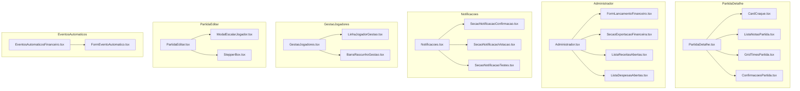

# 📋 Plano de Implementação: P1-4 — Componentes Gigantes com Responsabilidade Misturada

> **Item da Auditoria**: `P1-4` de [`docs/plano-refatoracoes.md`](./plano-refatoracoes.md)  
> **Status**: Proposto / Planejamento Arquitetural (Auditado e Aprovado por Subagentes)  
> **Fontes Canônicas**: [`AGENTS.md`](../AGENTS.md) e [`design-system.md`](../design-system.md)  
> **Escopo**: `src/routes/PartidaDetalhe.tsx`, `src/routes/Administrador.tsx`, `src/routes/Notificacoes.tsx`, `src/routes/GestaoJogadores.tsx`, `src/routes/PartidaEditar.tsx`, `src/components/EventosAutomaticosFinanceiro.tsx`.

---

## 🎯 1. Visão Geral e Racional Arquitetural

Seis arquivos do projeto acumulam mais de 700 linhas cada (alguns com mais de 850 linhas e até 20 hooks `useState`), misturando lógica de coordenação de tela, formulários complexos, listas agrupadas com ações transacionais, subcomponentes inline e modais inteiros declarados no mesmo arquivo.

### 🚫 Problemas Identificados:
1. **Dificuldade de Manutenção e Auditoria**: Arquivos massivos dificultam a leitura de fluxo e violam o princípio da responsabilidade única.
2. **Re-renderizações Excessivas**: Alterações em campos locais de formulários (ex: inputs de lançamento financeiro ou filtros de busca) forçam a re-avaliação do componente pai inteiro e suas listas filhas.
3. **Acoplamento de Domínio e UI**: Subcomponentes de alta complexidade (como confirmações de presença e formulários automáticos) vivem acoplados dentro das rotas em vez de módulos reutilizáveis e testáveis.

### 🎯 Objetivos da Refatoração:
1. **Reduzir o tamanho de todas as rotas gigantes para menos de 300-350 linhas**, transformando as rotas em orquestradores limpos de estado, cache e navegação.
2. **Modularizar os blocos em componentes especializados** em `src/components/`, com interfaces de props tipadas estritamente e contratos unidirecionais claros.
3. **Preservar integralmente o comportamento funcional existente**, sem quebrar rotas, sincronização de dados ou contratos de banco.
4. **Fidelidade estrita aos pilares do [`AGENTS.md`](../AGENTS.md) e [`design-system.md`](../design-system.md)**: Strict Rules of Hooks, alvos de toque $\ge 44\text{px}$, tipografia oficial (`font-display`, `font-sans`, `font-mono`), tokens semânticos e sombras `shadow-carimbo`.

---

## 📐 2. Matriz de Componentes e Estratégia de Quebra



---

## 🛠️ 3. Detalhamento Técnico das Extrações por Rota

---

### 3.1. `src/routes/PartidaDetalhe.tsx` (828 linhas $\to \approx 220$ linhas)

#### Componentes a Extrair:

1. **[NEW] `src/components/ConfirmacoesPartida.tsx`** ($\approx 250$ linhas)
   - **Responsabilidade**: Gerenciar e renderizar a lista de confirmações de presença dos mensalistas e avulsos durante a fase `draft` da partida, incluindo:
     - Badge e contagem de vagas (`ocupadas / CAPACIDADE_PARTIDA`).
     - Alerta de prazo (`confirmacao_closes_at`).
     - Subcomponentes privados de botões do atleta (`BotoesSelf`) e botões de admin (`BotoesAdmin`) com alvos $\ge 44\text{px}$.
     - Painel expansível de adição de avulsos com ordenação por frequência recente.
   - **Props Interface**:
     ```tsx
     export interface ConfirmacoesPartidaProps {
       partida: Partida;
       participantes: Participante[];
       jogadorLogadoId: number | null;
       isAdmin: boolean;
       onAtualizar: () => Promise<void> | void;
     }
     ```

2. **[NEW] `src/components/CardCraquePartida.tsx`** ($\approx 40$ linhas)
   - **Responsabilidade**: Exibir o card de destaque com rotação seca (`-rotate-1`), fita adesiva translúcida, nota média com tipografia `font-mono text-3xl font-black text-destaque-texto`, total de votos e avatar com borda âmbar quando a partida estiver `closed`.
   - **Props Interface**:
     ```tsx
     export interface CardCraquePartidaProps {
       craque: NotaPartida;
     }
     ```

3. **[NEW] `src/components/ListaNotasPartida.tsx`** ($\approx 45$ linhas)
   - **Responsabilidade**: Renderizar a lista de notas da súmula oficial da partida (`closed`), exibindo cada participante com avatar, username, badge de estrela para o craque, e nota média aparada (`avg_rating`) com total de votos em `font-mono tabular-nums`.
   - **Props Interface**:
     ```tsx
     export interface ListaNotasPartidaProps {
       notas: NotaPartida[];
     }
     ```

4. **[NEW] `src/components/GridTimesPartida.tsx`** ($\approx 65$ linhas)
   - **Responsabilidade**: Renderizar o grid de 2 colunas com a escalação oficial dos times Preto (`'a'`) e Branco (`'b'`), utilizando `CabecalhoTime` e listando cada jogador com avatar, crachá de posição, e contadores de gols (`⚽`), assistências (`🅰️`) e gols contra (`GC:` em `text-perigo`).
   - **Props Interface**:
     ```tsx
     export interface GridTimesPartidaProps {
       participantesPorTime: Record<TimeId, Participante[]>;
     }
     ```

#### [MODIFY] `src/routes/PartidaDetalhe.tsx`:
- Fica restrito ao carregamento concorrente dos dados (`Promise.all`), controle dos diálogos (`ConfirmDialog` para descarte de votos e abertura de partida), e orquestração dos componentes extraídos.

---

### 3.2. `src/routes/Administrador.tsx` (824 linhas $\to \approx 230$ linhas)

#### Componentes a Extrair:

1. **[NEW] `src/components/FormLancamentoFinanceiro.tsx`** ($\approx 150$ linhas)
   - **Responsabilidade**: Formulário de registro manual de receitas ou despesas com alternância de natureza (`'receita'` vs `'despesa'`), seleção de jogador, seletor de tipo de lançamento (`mensalidade`, `avulso`, `goleiro`, `campo`, `eventos`, `outro`), campos de valor monetário com `inputMode="decimal"`, data, referência de mês e descrição.
   - **Props Interface**:
     ```tsx
     export interface FormLancamentoFinanceiroProps {
       jogadores: JogadorLista[];
       onSucesso: (mensagem: string) => void;
       onErro: (mensagem: string) => void;
       onRecarregar: () => Promise<void>;
     }
     ```

2. **[NEW] `src/components/SecaoExportacaoFinanceira.tsx`** ($\approx 50$ linhas)
   - **Responsabilidade**: Seção de exportação para Excel (SpreadsheetML `.xls`), com inputs de data inicial e data final, validação de período e acionamento de `baixarExcelLancamentos` via `src/lib/exportacao.ts` (Item 6 do P3-8).
   - **Props Interface**:
     ```tsx
     export interface SecaoExportacaoFinanceiraProps {
       onNotificar: (tipo: 'sucesso' | 'erro', mensagem: string) => void;
     }
     ```

3. **[NEW] `src/components/ListaReceitasAbertas.tsx`** ($\approx 135$ linhas)
   - **Responsabilidade**: Renderizar o sumário e a lista agrupada de receitas pendentes por atleta, com indicador expansível (`ChevronDown`), total devido em `text-perigo`, botão de atalho para copiar mensagem de cobrança formatada para WhatsApp, botão "Quitar todas" e lista interna de lançamentos com botão "Pagar".
   - **Props Interface**:
     ```tsx
     export interface ListaReceitasAbertasProps {
       grupos: DividaPorJogador[];
       carregando: boolean;
       expandido: number | null;
       onAlternarExpandido: (jogadorId: number | null) => void;
       onCopiarWhatsApp: (e: React.MouseEvent, g: DividaPorJogador) => void;
       onSolicitarQuitar: (dividaId: number, username: string) => void;
       onSolicitarQuitarTodas: (jogadorId: number, username: string) => void;
     }
     ```

4. **[NEW] `src/components/ListaDespesasAbertas.tsx`** ($\approx 95$ linhas)
   - **Responsabilidade**: Renderizar a lista de despesas em aberto do caixa do racha ou a pagar para atletas/goleiros, com badges semânticos, cópia rápida de chave PIX com feedback e botão de quitação ("Pagar").
   - **Props Interface**:
     ```tsx
     export interface ListaDespesasAbertasProps {
       despesas: Divida[];
       carregando: boolean;
       onCopiarPix: (chave: string) => void;
       onSolicitarQuitar: (dividaId: number, rotulo: string) => void;
     }
     ```

#### [MODIFY] `src/routes/Administrador.tsx`:
- Centraliza os hooks de carregamento (`useCallback`), o estado dos dados financeiros (`grupos`, `despesas`, `jogadores`), o `ConfirmDialog` unificado para quitações e o `PullToRefresh`.

---

### 3.3. `src/routes/Notificacoes.tsx` (740 linhas $\to \approx 190$ linhas)

#### Componentes a Extrair:

1. **[NEW] `src/components/SecaoNotificacaoConfirmacao.tsx`** ($\approx 175$ linhas)
   - **Responsabilidade**: Seção 1 do painel de notificações com toggle de ativação semanal, botão gatilho para abertura do modal de agendamento (`dia_semana` + `horario`), visualizador das variáveis `{dia_jogo}`, `{hora_jogo}`, `{prazo}`, inputs de título e mensagem, e sub-bloco de Reforço (2º aviso) com antecedência em horas.
   - **Props Interface**:
     ```tsx
     export interface SecaoNotificacaoConfirmacaoProps {
       config: NotificacoesConfig;
       onChangeConfig: React.Dispatch<React.SetStateAction<NotificacoesConfig | null>>;
       onAbrirModalAgendamento: () => void;
       onAbrirModalReforco: () => void;
     }
     ```

2. **[NEW] `src/components/SecaoNotificacaoVotacao.tsx`** ($\approx 140$ linhas)
   - **Responsabilidade**: Seção 2 com toggle de lembretes pós-jogo, grade de checkboxes dos buckets de antecedência (6h, 3h, 1h, 30m) e acordeão de customização textual de mensagens por intervalo. Contém as constantes `BUCKETS_VOTACAO` e `TEMPLATES_VOTACAO`.
   - **Props Interface**:
     ```tsx
     export interface SecaoNotificacaoVotacaoProps {
       config: NotificacoesConfig;
       onChangeConfig: React.Dispatch<React.SetStateAction<NotificacoesConfig | null>>;
     }
     ```

3. **[NEW] `src/components/SecaoNotificacaoTestes.tsx`** ($\approx 90$ linhas)
   - **Responsabilidade**: Seção 3 com os cards de disparo manual: teste imediato de push no aparelho do admin conectado e reenvio de convite semanal para a partida em draft.
   - **Props Interface**:
     ```tsx
     export interface SecaoNotificacaoTestesProps {
       pushStatus: StatusPush;
       partidaDraft: PartidaDraftAtual | null;
       disparandoTeste: boolean;
       disparandoReenvio: boolean;
       onTestarPush: () => void;
       onSolicitarReenvio: () => void;
     }
     ```

#### [MODIFY] `src/routes/Notificacoes.tsx`:
- Fica responsável pela persistência das configurações na RPC `salvar_configuracoes_notificacoes`, controle dos modais (`ModalSelecionarAgendamento`, `ModalSelecionarOpcao`, `ConfirmDialog`) e feedback via `Snackbar`.

---

### 3.4. `src/routes/GestaoJogadores.tsx` (731 linhas $\to \approx 240$ linhas)

#### Componentes a Extrair:

1. **[NEW] `src/components/LinhaJogadorGestao.tsx`** ($\approx 170$ linhas)
   - **Responsabilidade**: Renderização individual do card de cada atleta na lista de gestão com:
     - Avatar terroso com crachá de posição.
     - Username e badges contextuais (`Superadmin`, `Admin`, `Mensalista`, `Avulso`, `🧤 Isento (Goleiro)`).
     - Indicador animado de alteração pendente (`Sparkles` / `Pendente`).
     - Botão tátil interativo para alternar status de Mensalista (com bloqueio por capacidade e isenção de goleiro).
     - Botão tátil interativo para alternar status de Administrador (com guard de Superadmin e exigência de mensalista).
     - Botão para reset de senha padrão ("123").
   - **Props Interface**:
     ```tsx
     export interface LinhaJogadorGestaoProps {
       jogador: JogadorLista;
       jogadorOriginal: JogadorLista;
       isModificado: boolean;
       limiteAtingido: boolean;
       salvandoLote: boolean;
       resetandoId: number | null;
       onAlternarMensalista: (j: JogadorLista) => void;
       onAlternarAdmin: (j: JogadorLista) => void;
       onSolicitarResetSenha: (j: JogadorLista) => void;
     }
     ```

2. **[NEW] `src/components/BarraRascunhoGestao.tsx`** ($\approx 50$ linhas)
   - **Responsabilidade**: Barra flutuante inferior fixada com posicionamento seguro acima da TabBar (`bottom-[calc(4.5rem+env(safe-area-inset-bottom,0px)+0.75rem)]`), exibida quando houver alterações pendentes no lote (`temAlteracoes`), contendo o contador de mudanças, botão de descarte e botão de confirmação transacional em lote.
   - **Props Interface**:
     ```tsx
     export interface BarraRascunhoGestaoProps {
       qtdModificacoes: number;
       salvandoLote: boolean;
       onDescartar: () => void;
       onSalvar: () => void;
     }
     ```

#### [MODIFY] `src/routes/GestaoJogadores.tsx`:
- Fica responsável pelo fetch de atletas, gerência do dicionário de rascunhos `Record<number, AlteracaoRascunho>`, filtros de abas e busca textual via `CampoBusca`, submissão do lote à RPC `salvar_caracteristicas_jogadores` e diálogo de reset de senha.

---

### 3.5. `src/routes/PartidaEditar.tsx` (660 linhas $\to \approx 320$ linhas)

#### Componentes a Extrair:

1. **[NEW] `src/components/ModalEscalarJogador.tsx`** ($\approx 100$ linhas)
   - **Responsabilidade**: Modal acessível construído sobre `ModalBase` para seleção e escalação de novos jogadores em um time específico (`timeA` ou `timeB`), contendo campo de busca (`CampoBusca` com `autoFocus`), filtros rápidos (`todos`, `goleiros`, `linha`, `mensalistas`, `avulsos`) e lista rolante com alvos de toque $\ge 48\text{px}$.
   - **Props Interface**:
     ```tsx
     export interface ModalEscalarJogadorProps {
       open: boolean;
       timeDestino: TimeId | null;
       jogadoresDisponiveis: JogadorLista[];
       onSelecionarJogador: (jogador: JogadorLista, time: TimeId) => void;
       onClose: () => void;
     }
     ```

2. **[NEW] `src/components/StepperBox.tsx`** ($\approx 75$ linhas)
   - **Responsabilidade**: Contador tátil compacto com botões `−` e `+` de no mínimo $44 \times 44\text{px}$, feedback tátil, variantes de cores semânticas (`destaque`, `azul`, `perigo`) e visualização numérica em `font-mono text-base font-black`.
   - **Props Interface**:
     ```tsx
     export interface StepperBoxProps {
       icone: string;
       label: string;
       valor: number;
       corAtiva: 'destaque' | 'azul' | 'perigo';
       disabled?: boolean;
       onMenos: () => void;
       onMais: () => void;
     }
     ```

#### [MODIFY] `src/routes/PartidaEditar.tsx`:
- Fica focado na sincronização dos participantes da partida, cálculo derivado do placar via `calcularPlacarDeParticipantes`, mutação atômica em `salvarEdicaoCompletaPartida` e diálogos de confirmação.

---

### 3.6. `src/components/EventosAutomaticosFinanceiro.tsx` (476 linhas $\to \approx 160$ linhas)

#### Componentes a Extrair:

1. **[NEW] `src/components/FormEventoAutomatico.tsx`** ($\approx 175$ linhas)
   - **Responsabilidade**: Formulário isolado para criação ou edição de um evento automático financeiro com seleção de gatilho (`mensal`, `semanal`), natureza (`despesa`, `receita`), tipo, valor numérico, destino do caixa ou atleta fixo, descrição com templates e toggle de status ativo.
   - **Props Interface**:
     ```tsx
     export interface FormEventoAutomaticoProps {
       eventoEmEdicao?: EventoFinanceiroAutomatico | null;
       jogadores: JogadorLista[];
       salvando: boolean;
       onSalvar: (dados: EventoFinanceiroAutomaticoPayload) => Promise<void>;
       onCancelar: () => void;
     }
     ```

#### [MODIFY] `src/components/EventosAutomaticosFinanceiro.tsx`:
- Fica restrito à listagem de eventos cadastrados, badges de status, botões de ação (editar/excluir) e acionamento do diálogo de confirmação.

---

## 🧪 4. Plano de Verificação e Testes

### 4.1. Verificação Estática e Compilação
- Executar `npm run lint` e garantir **0 erros e 0 advertências** no ESLint Flat Config.
- Executar `npm run build` e certificar compilação sem erros no TypeScript estrito (`tsc --noEmit`).

### 4.2. Testes de Regressão Funcional
1. **Partida Detalhe**:
   - Testar visualização de partida `draft` (confirmar presença, desconfirmar, adicionar avulso).
   - Testar visualização de partida `live` (atalho para súmula ao vivo).
   - Testar visualização de partida `published` (votação de notas e descarte de votos).
   - Testar visualização de partida `closed` (card do craque e lista completa de notas ordenadas).
2. **Controle Financeiro**:
   - Criar lançamento de receita e de despesa.
   - Testar exportação para Excel no período filtrado.
   - Quitar lançamento individual e quitar todas as receitas de um atleta.
   - Copiar cobrança para WhatsApp e copiar chave PIX.
3. **Gestão de Notificações**:
   - Alterar horário de disparo e antecedência do reforço.
   - Modificar mensagens personalizadas de convite e buckets de votação.
   - Disparar push de teste no dispositivo conectado.
4. **Gestão de Atletas**:
   - Alternar status de mensalista e admin em múltiplos atletas gerando rascunhos.
   - Testar botão de descarte de alterações.
   - Confirmar salvamento em lote no servidor e verificar feedback visual.
   - Executar reset de senha de um atleta e verificar prompt de confirmação.
5. **Edição de Súmula**:
   - Abrir modal de escalar jogador, filtrar por goleiros/linha e adicionar a um time.
   - Alterar gols, assistências e gols contra utilizando os botões do `StepperBox`.
   - Salvar edição da partida e verificar atualização do placar e histórico.
