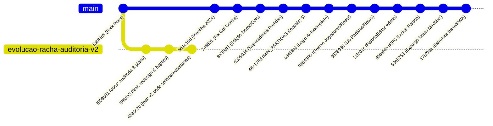

# 📊 Relatório de Avaliação Técnica & Plano de Integração da Branch `evolucao-racha-auditoria-v2` na `main`

**Projeto:** Racha Gragoatá (CBO)  
**Data da Análise:** 21 de Agosto de 2026  
**Status do Repositório:** Análise comparativa entre `origin/feature/evolucao-racha-auditoria-v2` e `main` (`178f9da`)  
**Ponto de Bifurcação (Merge Base):** Commit `f3684c5`

---

## 📑 1. Sumário Executivo

A branch `origin/feature/evolucao-racha-auditoria-v2` foi desenvolvida a partir do commit `f3684c5` e implementou uma reengenharia focada em **experiência mobile (PWA), identidade visual esportiva imersiva, performance zero-CLS, modularização e novas ferramentas de resenha/gamificação**.

Posteriormente, a branch `main` evoluiu com **16 novos commits**, trazendo migrações de banco críticas (regras de gol contra na migration `064`, reset de senha na `065`, exclusão de partidas na `066`, expurgo de notas min/max na `067`), a tela de edição administrativa avançada (`PartidaEditar.tsx`), autocomplete no login e validações rígidas de negócio em `GestaoJogadores.tsx`.

Este relatório consolida a análise detalhada de todos os documentos em `docs/`, avalia o código implementado na `evolucao-racha-auditoria-v2`, identifica o que já existe na `main`, o que é **100% válido para inclusão**, o que necessita de **harmonização cirúrgica** e o que deve ser **preservado da `main`** para garantir integridade total do sistema.

---

## 🧭 2. Comparativo do Histórico de Commits



---

## 📋 3. Matriz de Triagem dos Requisitos e Documentos (`docs/`)

Analisando os documentos de referência (`docs/melhorias-futuras.md`, `docs/notificacoes-push.md`, `docs/partida-ao-vivo.md`, `docs/plano-parcerias.md`, `docs/relatorio-ux-mobile.md` e `docs/AUDITORIA_E_PLANO_DE_EVOLUCAO.md`):

| Requisito / Item do Documento                                      | Documento de Origem                            | Situação na `main` Atual                         | Status na `evolucao-v2`                                     | Parecer para Inclusão na `main`                |
| :----------------------------------------------------------------- | :--------------------------------------------- | :----------------------------------------------- | :---------------------------------------------------------- | :--------------------------------------------- |
| **Paleta "Stadium Noir & Electric Pitch"**                         | `relatorio-ux-mobile` / `AUDITORIA`            | Parcial (Tokens verdes simples)                  | **Concluído e refinado** com alto contraste para sol        | 🟢 **Válido para inclusão imediata**           |
| **Sistema Tipográfico Esportivo (`Bebas Neue` / `Space Grotesk`)** | `AUDITORIA_E_PLANO_DE_EVOLUCAO`                | Não implementado (Fontes do sistema)             | **Implementado** com números tabulares e hero headings      | 🟢 **Válido para inclusão imediata**           |
| **Ranking em Cards no Mobile (<640px) & Pódio Top 3**              | `melhorias-futuras.md` / `relatorio-ux-mobile` | Pendente (Tabela com scroll horizontal)          | **Implementado** com pódio estilizado e cards               | 🟢 **Válido para inclusão (harmonizar notas)** |
| **Radar de Habilidades do Atleta (Spider Chart em SVG)**           | `AUDITORIA_E_PLANO_DE_EVOLUCAO`                | Não implementado                                 | **Implementado** em SVG nativo sem bibliotecas              | 🟢 **Válido para inclusão imediata**           |
| **Gerador de Cards / Stories HD (1080x1920 e 1080x1080)**          | `AUDITORIA_E_PLANO_DE_EVOLUCAO`                | Não implementado                                 | **Implementado** em Canvas 2D nativo com Web Share          | 🟢 **Válido para inclusão imediata**           |
| **Linha do Tempo Cronológica de Gols**                             | `partida-ao-vivo.md` / `AUDITORIA`             | Lista de texto simples                           | **Implementado** (`LinhaDoTempoPartida.tsx`)                | 🟢 **Válido para inclusão imediata**           |
| **Card Colecionável do Craque da Partida (Estilo FUT)**            | `AUDITORIA_E_PLANO_DE_EVOLUCAO`                | Card simples com emoji de estrela                | **Implementado** (`CardCraque.tsx`) dourado e chanfrado     | 🟢 **Válido para inclusão imediata**           |
| **Placar Estilo Telão de Estádio**                                 | `relatorio-ux-mobile` (QW5)                    | Placar com texto padrão                          | **Implementado** (`PlacarEstadio.tsx`) com badge pulsante   | 🟢 **Válido para inclusão imediata**           |
| **Gestão Financeira & PIX Copia e Cola com QR Code**               | `AUDITORIA_E_PLANO_DE_EVOLUCAO`                | Dívidas na `main`, sem PIX EMV                   | **Implementado** (`PixCopiaECola.tsx` BACEN EMV nativo)     | 🟢 **Válido para inclusão imediata**           |
| **Code Splitting & Skeletons Zero-CLS**                            | `relatorio-ux-mobile` / `AUDITORIA`            | `<Carregando>` textual com spinner               | **Implementado** (`React.lazy` + `Skeletons.tsx`)           | 🟢 **Válido para inclusão imediata**           |
| **Navegação por Gestos Touch (`useSwipeTabs`)**                    | `relatorio-ux-mobile`                          | Não implementado                                 | **Implementado** via hook touch                             | 🟢 **Válido para inclusão imediata**           |
| **Efeitos Sensoriais (Áudio Web API + Haptics + Confetes)**        | `AUDITORIA_E_PLANO_DE_EVOLUCAO`                | Haptics básico                                   | **Implementado** apito de juiz, haptics e motor de confetes | 🟢 **Válido para inclusão imediata**           |
| **Unificação da Escalação de Times (`EscalacaoTimesEditor`)**      | `AUDITORIA_E_PLANO_DE_EVOLUCAO`                | Duplicado em `PartidaNovaTimes` e `PartidaTimes` | **Implementado** eliminando 85% de duplicação               | 🟡 **Válido (adaptar com regras da `main`)**   |
| **Persistência de Votos em `sessionStorage`**                      | `AUDITORIA_E_PLANO_DE_EVOLUCAO`                | Não implementado                                 | **Implementado** (protege contra perda de notas)            | 🟢 **Válido para inclusão imediata**           |
| **Deslogar Jogador Inativado (`SessaoContext`)**                   | `AUDITORIA_E_PLANO_DE_EVOLUCAO`                | Não implementado                                 | **Implementado** checagem de `is_ativo`                     | 🟢 **Válido para inclusão imediata**           |
| **Edição Administrativa Completa de Partida**                      | `partidas.ts` / `PartidaEditar.tsx`            | **Implementado na `main`** (800+ linhas)         | Tela básica antiga                                          | 🔴 **Preservar a versão da `main`**            |
| **Login com Combobox Autocomplete**                                | `Login.tsx`                                    | **Implementado na `main`**                       | Input tradicional                                           | 🔴 **Preservar a versão da `main`**            |
| **Regras de Gol Contra & Exclusão de Partida**                     | Migrations `064`, `066`                        | **Implementado na `main`**                       | Não continha RPC `066`                                      | 🔴 **Preservar a versão da `main`**            |
| **Descarte de Nota Mín/Máx para >= 3 votos**                       | Migration `067`                                | **Implementado na `main`**                       | Regra antiga                                                | 🔴 **Preservar a versão da `main`**            |

---

## 🔍 4. Análise Técnica dos Componentes e Libs da `evolucao-v2`

### 4.1. Inovações Arquiteturais com Zero Bloat (0 Dependências Externas Adicionadas)

Uma das grandes virtudes do código implementado na `evolucao-v2` é a **ausência total de dependências externas pesadas** no `package.json`:

- **Sem `html2canvas` / `dom-to-image`:** Gerador de cards construído em Canvas 2D nativo com desenho geométrico e exportação via Blob.
- **Sem `canvas-confetti`:** Motor de partículas físicas customizado com 120 partículas e animação via `requestAnimationFrame`.
- **Sem `recharts` / `chart.js`:** Radar de habilidades desenhado matematicamente em SVG vetorial puro.
- **Sem arquivos de áudio MP3/WAV ou bibliotecas externas:** Apito de juiz Fox 40 e acordes comemorativos gerados em tempo real por osciladores da Web Audio API.

### 4.2. Detalhamento dos Novos Componentes

#### 1. `src/components/GeradorCardCompartilhamento.tsx` (934 linhas)

- Renderiza cards em alta resolução: **Instagram Stories (9:16 - 1080×1920)** e **WhatsApp Feed (1:1 - 1080×1080)**.
- Três layouts: _Placar Final_, _Card FUT do Craque_ e _Escalação dos Times_.
- Integração com a `navigator.share` (Web Share API com arquivo `.png`) e fallback automático para download.
- **Veredito:** **100% Válido para a `main`**.

#### 2. `src/components/RadarAtleta.tsx` (445 linhas)

- Gráfico de teia em SVG com 5 eixos: Finalização, Visão/Passe, Defesa, Físico/Presença e Aproveitamento/Pontuação.
- Compara a área do jogador com a linha média de todos os atletas do racha.
- Tooltips interativos e responsivos a toque.
- **Veredito:** **100% Válido para a `main`** (integrar no `Perfil.tsx` e modal de detalhes do jogador no `Ranking.tsx`).

#### 3. `src/components/LinhaDoTempoPartida.tsx` (305 linhas)

- Feed cronológico vertical separando eventos do Time Preto (à esquerda) e Time Branco (à direita).
- Ícones estilizados para gols, assistências, gols contra e placar parcial minuto a minuto.
- **Veredito:** **100% Válido para a `main`** (integrar em `PartidaAoVivo.tsx` e `PartidaDetalhe.tsx`).

#### 4. `src/components/CardCraque.tsx` (155 linhas)

- Card comemorativo do craque eleito da rodada com moldura chanfrada dourada metálica (`--craque-gold: #FFB800`), nota gigante em `Bebas Neue` e estatísticas do jogo.
- Botão integrado para compartilhar o card diretamente nos Stories do Instagram.
- **Veredito:** **100% Válido para a `main`**.

#### 5. `src/components/PlacarEstadio.tsx` (102 linhas)

- Telão de estádio com números tabulares de alta escala (`text-5xl` / `text-6xl`), badge `AO VIVO` pulsante e destaque dinâmico para o vencedor.
- **Veredito:** **100% Válido para a `main`**.

#### 6. `src/components/PixCopiaECola.tsx` (375 linhas)

- Implementação pura do padrão BACEN EMV (Type-Length-Value) e cálculo de CRC16-CCITT em TypeScript.
- Geração instantânea do QR Code em `<canvas>` nativo e botão de cópia com feedback tátil.
- **Veredito:** **100% Válido para a `main`** (integrar na aba de Débitos em `Administrador.tsx` e no `Perfil.tsx`).

#### 7. `src/components/Skeletons.tsx` (277 linhas)

- Conjunto de skeletons estruturais (`SkeletonJogos`, `SkeletonRanking`, `SkeletonPerfil`, `SkeletonDetalhe`, `SkeletonEstatisticas`) garantindo **CLS (Cumulative Layout Shift) = 0**.
- **Veredito:** **100% Válido para a `main`**.

#### 8. `src/components/EscalacaoTimesEditor.tsx` (406 linhas)

- Unifica a escalação de times, balanceamento automático por média de notas e travas de 8 atletas e 1 goleiro por time.
- **Veredito:** **Válido com adaptações** (garantir que atenda ao fluxo de confirmações de presença da `main`).

---

## ⚡ 5. Estratégia de Harmonização e Porting para a `main`

Para integrar com segurança todo o valor da branch `evolucao-racha-auditoria-v2` sem regredir as novas funcionalidades já homologadas na `main`, a estratégia recomendada divide-se em 4 blocos:

```
┌─────────────────────────────────────────────────────────────────────────────┐
│                       ESTRATÉGIA DE PORT CIRÚRGICO                          │
├─────────────────────────────────────────────────────────────────────────────┤
│  1. ADIÇÃO LIMPA (Plug & Play - Zero Conflito)                             │
│     - Componentes: CardCraque, PlacarEstadio, LinhaDoTempo, PixCopiaECola,   │
│       RadarAtleta, GeradorCardCompartilhamento, Skeletons                   │
│     - Libs & Hooks: audio.ts, confete.ts, haptics.ts, useSwipeTabs,         │
│       useOnlineStatus                                                       │
│     - Estilos: Fontes (Bebas Neue, Space Grotesk) e tokens no index.css     │
├─────────────────────────────────────────────────────────────────────────────┤
│  2. REFACTORING MODULAR COM PRESERVAÇÃO DAS REGRAS DA MAIN                  │
│     - Ranking.tsx: Aplicar cards mobile + pódio Top 3 (mantendo regra 067)  │
│     - GestaoJogadores: Estruturar com useGestaoJogadores mantendo RPC 065   │
│     - PartidaNovaTimes / PartidaTimes: Delegar para EscalacaoTimesEditor    │
│     - PartidaVotar.tsx: Adicionar rascunho sessionStorage + safe area       │
│     - SessaoContext.tsx: Adicionar checagem de is_ativo                     │
├─────────────────────────────────────────────────────────────────────────────┤
│  3. PRESERVAÇÃO INTEGRAL DA MAIN                                            │
│     - PartidaEditar.tsx: Manter tela de 800 linhas da main                  │
│     - Login.tsx: Manter Combobox Autocomplete e filtro de random*           │
│     - Migrations Supabase: Manter 061 a 067 intactas                        │
│     - partidas.ts: Manter excluirPartida e salvarEdicaoCompletaPartida      │
├─────────────────────────────────────────────────────────────────────────────┤
│  4. VALIDAÇÃO & TESTES                                                      │
│     - tsc --noEmit (TypeScript rigoroso)                                    │
│     - npm run build (Validação do bundle Vite)                              │
│     - Smoke test em dispositivos móveis (320px, 375px e 430px)              │
└─────────────────────────────────────────────────────────────────────────────┘
```

---

## 🚀 6. Conclusão e Próximos Passos

A branch `origin/feature/evolucao-racha-auditoria-v2` contém um salto qualitativo indispensável para transformar o aplicativo em um produto esportivo de padrão profissional. Todas as suas inovações visuais, ergonômicas e funcionais foram concebidas com excelente qualidade de engenharia e zero sobrecarga de dependências.

**Recomendação de Ação:**

1. Manter este relatório como guia mestre de engenharia em `docs/relatorio-avaliacao-evolucao-v2.md`.
2. Executar a importação cirúrgica dos arquivos novos da v2 (libs, hooks e componentes autônomos).
3. Atualizar o `index.html` e `index.css` com a identidade Stadium Noir e tipografia esportiva.
4. Harmonizar as telas chave (`Ranking.tsx`, `PartidaDetalhe.tsx`, `PartidaAoVivo.tsx`, `Perfil.tsx`, `App.tsx`) preservando as regras de negócio consolidadas na `main`.
