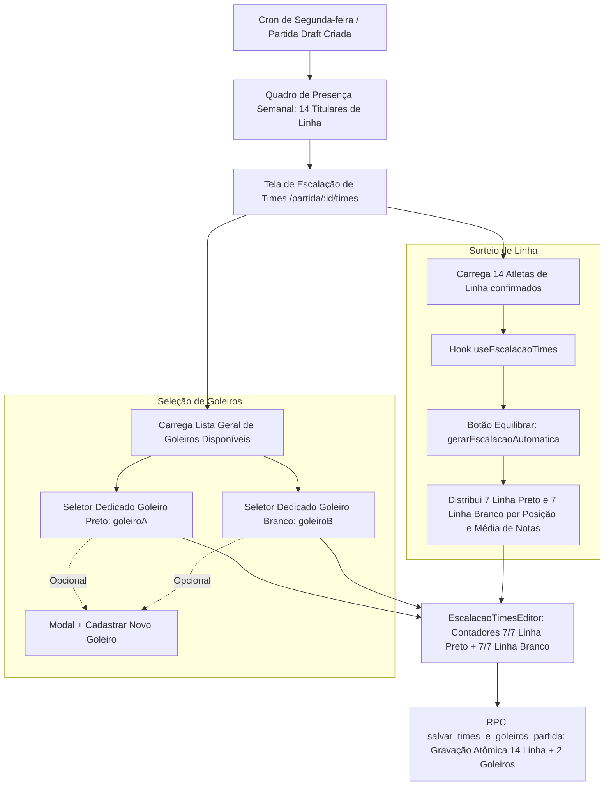

# Diagnóstico e Plano de Unificação: Escalação Automática e Gestão de Goleiros

> **Status**: Proposta Técnica / Diagnóstico de Divergência  
> **Data**: Agosto de 2026  
> **Telas Analisadas**:
>
> 1. `/partida/nova/times` (`src/routes/PartidaNovaTimes.tsx`) — Criação manual de partida
> 2. `/partida/:id/times` (`src/routes/PartidaTimes.tsx`) — Partida semanal (criada automaticamente pelo cron de segunda-feira)  
>    **Componente Visual Compartilhado**: `src/components/EscalacaoTimesEditor.tsx`  
>    **Algoritmo de Divisão**: `src/lib/escalacao.ts` (`gerarEscalacaoAutomatica`)

---

## 📑 Sumário

1. [Resumo Executivo do Problema](#1-resumo-executivo-do-problema)
2. [Análise Comparativa dos Dois Fluxos](#2-análise-comparativa-dos-dois-fluxos)
3. [Diagnóstico da Causa Raiz](#3-diagnóstico-da-causa-raiz)
4. [O Processo Canônico Correto (Partida Semanal de Segunda)](#4-o-processo-canônico-correto-partida-semanal-de-segunda)
5. [Plano de Unificação e Centralização](#5-plano-de-unificação-e-centralização)
6. [Plano de Implementação e Arquivos Afetados](#6-plano-de-implementação-e-arquivos-afetados)
7. [Matriz de Verificação e Testes](#7-matriz-de-verificação-e-testes)

---

## 1. Resumo Executivo do Problema

Ao utilizar a tela de criação manual de partida em **`/partida/nova/times`** e acionar o botão **"Equilibrar"** (Escalação Automática):

1. O algoritmo **divide automaticamente os 2 goleiros** entre Time Preto e Time Branco e os inclui na contagem de jogadores de linha.
2. A tela exibe o placar de contagem como **`8/7 de linha`** no Time Preto e **`8/7 de linha`** no Time Branco (em vermelho / inválido).
3. O botão de salvar fica permanentemente desabilitado porque a validação espera exatamente **7 jogadores de linha por time**, mas o array de `times` possui 8 atletas por time.
4. **Divergência**: Na partida semanal gerada pelo cron de segunda-feira (`/partida/:id/times`), o botão **"Equilibrar"** sorteia **estritamente os 14 jogadores de linha** (7 no Preto e 7 no Branco). Os 2 goleiros são selecionados em campos dedicados no topo de cada time (`goleiroA` e `goleiroB`), sem interferir na cota dos 14 de linha e sem serem distribuídos arbitrariamente pelo sorteio de linha.

---

## 2. Análise Comparativa dos Dois Fluxos

| Aspecto                            | 🟢 Partida Automática de Segunda (`/partida/:id/times`)                                                          | 🔴 Partida Manual Nova (`/partida/nova/times`)                                                                     |
| :--------------------------------- | :--------------------------------------------------------------------------------------------------------------- | :----------------------------------------------------------------------------------------------------------------- |
| **Origem dos Dados**               | Partida `draft` existente no banco (`id`), presença confirmada via `partidas_participantes`.                     | Dados em memória via `location.state` (selecionados na Etapa 1 e confirmados na Etapa 2).                          |
| **Entrada do `useEscalacaoTimes`** | **Apenas os 14 jogadores de linha confirmados** (`confirmadosJogadores`, filtrando `posicao !== 'goleiro'`).     | **16 jogadores** (14 de linha + 2 goleiros misturados no mesmo array).                                             |
| **Comportamento do "Equilibrar"**  | Sorteia os 14 de linha em **7 Preto vs 7 Branco** equilibrados por posição primária/secundária e média de notas. | Sorteia 16 jogadores: aloca 1 goleiro + 7 de linha no Preto e 1 goleiro + 7 de linha no Branco (total 8 por time). |
| **Seletores de Goleiro**           | **Presentes e Dedicados**: cards no topo com dropdowns táticos, busca, troca e modal `+ Novo Goleiro`.           | **Ausentes**: props de goleiro não são passadas para `EscalacaoTimesEditor`.                                       |
| **Contadores de Linha**            | Exibe **`7/7 de linha`** (Preto) e **`7/7 de linha`** (Branco) — Status Válido (Verde).                          | Exibe **`8/7 de linha`** (Preto) e **`8/7 de linha`** (Branco) — Status Inválido (Vermelho).                       |
| **Lista de Jogadores**             | Lista apenas os 14 atletas de linha.                                                                             | Lista os 16 atletas (goleiros aparecem com botões "Preto/Branco" como se fossem de linha).                         |
| **Persistência / Salvamento**      | Chama RPC `salvar_times_e_goleiros_partida(p_partida_id, p_times_linha, p_goleiro_a_id, p_goleiro_b_id)`.        | Chama RPC legado `criar_partida(p_data_jogo, p_criado_por, p_participantes)`.                                      |

---

## 3. Diagnóstico da Causa Raiz

A divergência decorre da evolução histórica da arquitetura de goleiros do sistema (implementada nas migrações `081_...` a `093_...`):

### 3.1 Goleiros Tornaram-se Entidades de Posição Dedicada

Na refatoração canônica consolidada em `docs/implementation_plan_gestao_goleiros.md`:

- O racha tem **14 vagas de linha titulares** (confirmadas semanalmente).
- Os **2 goleiros são escalados em slots dedicados** (`goleiroA` e `goleiroB`) na tela de times.
- Os goleiros têm regras financeiras e de votação próprias (despesa de R$ 30, isenção de avulso, não votam na cédula pós-jogo).

### 3.2 Código Legado Remanescente no Fluxo Manual

O fluxo de criação manual (`PartidaNova.tsx` → `PartidaConfirma.tsx` → `PartidaNovaTimes.tsx`) **não foi totalmente migrado** para esse novo modelo:

1. `PartidaNova.tsx` exige selecionar 14 de linha + 2 goleiros (16 selecionados).
2. `PartidaNovaTimes.tsx` repassa os 16 atletas para o hook `useEscalacaoTimes`.
3. `PartidaNovaTimes.tsx` **não instanciava nem passava** as props `goleirosDisponiveis`, `goleiroA`, `goleiroB`, `onSelecionarGoleiroA`, `onSelecionarGoleiroB` ao `EscalacaoTimesEditor`.
4. Em `src/lib/escalacao.ts`, a função `gerarEscalacaoAutomatica` ainda continha o bloco legado da "Fase 1 — Distribuição de Goleiros" (`goleiros = jogadoresComNota.filter(j => j.posicao === 'goleiro')`). Ao receber 16 atletas, o algoritmo dividia os 2 goleiros e gerava 8 participantes para cada time.
5. Com 8 jogadores por time no estado `times`, o componente `EscalacaoTimesEditor` calculava `count = 8` contra `LIMITE_POR_TIME = 7`, estourando a cota máxima e travando o fluxo.

---

## 4. O Processo Canônico Correto (Partida Semanal de Segunda)

O fluxo da partida gerada na segunda-feira (`/partida/:id/times`) é a **única fonte de verdade**:

---

## 5. Plano de Unificação e Centralização

Para garantir consistência absoluta, evitar duplicação de lógica e eliminar estados inválidos, adotaremos a seguinte estratégia:

### Diretriz 1: O Algoritmo `gerarEscalacaoAutomatica` Opera Apenas na Linha (14 Atletas)

- Remover da função `gerarEscalacaoAutomatica` (`src/lib/escalacao.ts`) o bloco legado de sorteio de goleiros.
- A função assume como pré-condição que recebe **exclusivamente os jogadores de linha**, distribuindo-os em exatamente `limitePorTime` (7) para o Time Preto e `limitePorTime` (7) para o Time Branco.

### Diretriz 2: Centralização da Tela de Divisão de Times

Existem duas abordagens de implementação para o fluxo manual:

#### 🏆 Abordagem Recomendada (Criação Direta do Draft + Redirecionamento)

Em vez de manter duas telas de times distintas (`PartidaNovaTimes.tsx` e `PartidaTimes.tsx`):

1. O admin acessa `/partida/nova` para escolher a data da partida manual.
2. Ao confirmar, o sistema cria a partida em `draft` no banco via RPC (`criar_partida_draft`) e redireciona imediatamente para **`/partida/:id/times`**.
3. **Vantagem**: Elimina `PartidaNovaTimes.tsx` e `PartidaConfirma.tsx`. Todo o código de escalação, seleção de goleiros, modal de novo goleiro, cópia de escalação para WhatsApp e salvamento fica **100% centralizado em uma única tela** (`PartidaTimes.tsx`).

#### 🔄 Abordagem Alternativa (Alinhamento Estrito do Wizard Manual)

Se for mandatório manter o fluxo pré-salvamento em memória (sem gravar a partida no banco até a tela final de times):

1. `PartidaNova.tsx`: Atualizar a seleção para selecionar **apenas os 14 jogadores de linha** (removendo a cota de goleiros da Etapa 1).
2. `PartidaNovaTimes.tsx`:
   - Passar apenas os 14 jogadores de linha para `useEscalacaoTimes`.
   - Carregar `listarGoleiros()` e instanciar `goleiroA`, `goleiroB`, `ModalNovoGoleiro`.
   - Passar todas as props de goleiro para `EscalacaoTimesEditor`.
   - Ao salvar, criar a partida e registrar os 14 de linha + os 2 goleiros na mesma transação.

---

## 6. Plano de Implementação e Arquivos Afetados

### 6.1 Modificações no Frontend

1. **`src/lib/escalacao.ts`**:
   - Limpar a lógica legada da Fase 1 (distribuição de goleiros).
   - Documentar que o gerador opera estritamente com jogadores de linha.

2. **`src/routes/PartidaNova.tsx`**:
   - Ajustar cotas para focar nos 14 jogadores de linha titulares.

3. **`src/routes/PartidaConfirma.tsx`**:
   - Ajustar o resumo para exibir os 14 jogadores de linha selecionados.

4. **`src/routes/PartidaNovaTimes.tsx`** (ou consolidação via redirecionamento):
   - Adicionar o gerenciamento dos estados `goleiroA`, `goleiroB`, `goleirosDisponiveis`, `modalNovoGoleiro`.
   - Conectar os seletores de goleiro ao `EscalacaoTimesEditor`.
   - Garantir que `useEscalacaoTimes` receba estritamente os 14 jogadores de linha.

5. **`docs/algoritmo-sorteio-times.md`**:
   - Atualizar a documentação do algoritmo, marcando a remoção definitiva da Fase 1 legada.

---

## 7. Matriz de Verificação e Testes

| Cenário de Teste                                                        | Resultado Esperado                                                                                                                                                           |
| :---------------------------------------------------------------------- | :--------------------------------------------------------------------------------------------------------------------------------------------------------------------------- |
| **1. Clicar em "Equilibrar" em `/partida/:id/times` (Partida Semanal)** | Divide os 14 confirmados em 7 Preto e 7 Branco. Os goleiros `goleiroA` e `goleiroB` permanecem inalterados nos seus slots. Contadores: 7/7 Preto e 7/7 Branco.               |
| **2. Clicar em "Equilibrar" em `/partida/nova/times` (Partida Manual)** | Divide os 14 de linha em 7 Preto e 7 Branco. Goleiros são escolhidos nos seletores dedicados. Contadores: 7/7 Preto e 7/7 Branco (sem estourar para 8/7).                    |
| **3. Seleção de Goleiros em Ambos os Fluxos**                           | Permite escolher 1 goleiro para o Time Preto e 1 para o Time Branco. Impede selecionar o mesmo goleiro em ambos os times e impede escalar um goleiro que já esteja na linha. |
| **4. Habilitação do Botão Salvar**                                      | Habilita somente quando: 7 de linha no Preto + 7 de linha no Branco + 1 Goleiro no Preto + 1 Goleiro no Branco (total 16 atletas).                                           |
| **5. Copiar Escalações para WhatsApp**                                  | Gera o texto formatado idêntico nos dois fluxos (Goleiro na primeira linha, seguido dos 7 de linha ordenados por posição).                                                   |
