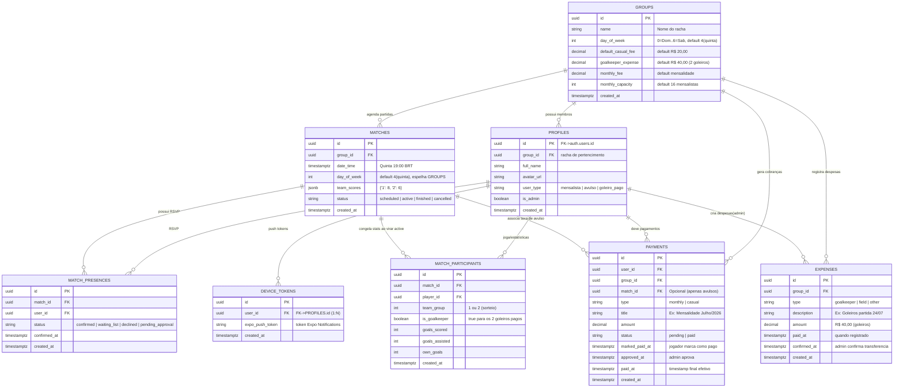

# PRD: App de Futebol entre Amigos (FutAmigos)

Atualizacao de implementacao (2026-08-01): o app usa **autenticacao local via tabela `profiles`** — login por username + senha (texto puro) validado pelo RPC `public.login`, sem `auth.users` por jogador e sem Supabase Auth. Sessao persistida localmente no Secure Store. RLS desativado (opção A, app de amigos). O admin técnico `dico` é provisionado pela migration `plain_auth` (senha inicial `futamigos`, trocar depois).

O restante deste documento preserva o contexto original do MVP.

Aplicativo mobile **cross-platform (iOS + Android)** construído com **React Native + Expo**, com backend **Supabase** (PostgreSQL + Auth + Realtime). Otimizado para a pelada das quintas-feiras às **19:00 (America/Sao_Paulo)**.

**Escopo do MVP**: app Android (APK via Expo EAS Build). iOS native só após o MVP (custo Apple Developer US$ 99/ano protelado).

> Diretório oficial do projeto: `c:\Users\Rian\Documents\GitHub\racha` (workspace atual).

---

## 🧩 Stack Tecnológica

| Camada              | Tecnologia                                                                                        |
| ------------------- | ------------------------------------------------------------------------------------------------- |
| Mobile              | **React Native 0.76+** + **Expo SDK 52+** (managed workflow)                                      |
| Linguagem           | **TypeScript 5+**                                                                                 |
| Navegação           | **Expo Router** (file-based)                                                                      |
| Backend / DB / Auth | **Supabase** (PostgreSQL 15, Auth, Realtime, Storage)                                             |
| Auth nativa         | **React Native Google Sign-In** (OAuth via Supabase). Apple Sign-In somente pós-MVP (nativo iOS). |
| Push notifications  | **Expo Notifications** (tokens em `DEVICE_TOKENS`)                                                |
| Scheduled jobs      | **pg_cron** (extensão Supabase) + Edge Functions opcional                                         |
| Builds              | **EAS Build** (Android APK no MVP)                                                                |
| Timezone            | **America/Sao_Paulo** (BRT/UTC-3). Timestamps em **UTC** no DB; conversão só na UI.               |

---

## 🎯 Regras de Negócio Confirmadas

### 1. Capacidade da Pelada

- **16 vagas totais**: 2 times x 7 jogadores de linha + **2 goleiros pagos** (1 por time).
- **Mensalistas**: capacidade configurável em `GROUPS.monthly_capacity` (default **16 fixos**). Administrável.
- **Avulsos**: fila de espera **FIFO**, sem limite máximo no MVP.

### 2. Autenticação

- **Provedores OAuth**: **apenas Google** no MVP (Supabase Auth). Apple Sign-In fica para pós-MVP (nativo iOS, exige conta Apple Developer US$ 99/ano). **Sem** email/senha, magic link ou phone OTP.
- `PROFILES` é criado no primeiro login via **trigger on `auth.users`** (`on conflict do nothing`).
- **Goleiros pagos NÃO fazem login** — cadastrados manualmente como `user_type='goleiro_pago'`, sem conta em `auth.users`.

### 3. Financeiro & Caixa

- **Avulso**: **R$ 20,00 fixo/partida** (`GROUPS.default_casual_fee`, default R$ 20).
- **Goleiros**: **R$ 40,00 total** (2 goleiros). São **recursos operacionais**, não jogadores:
  - `PROFILES.user_type='goleiro_pago'`, **sem login**, **sem cobrança**, **sem RSVP**.
  - Custo registrado como **despesa** na tabela `EXPENSES`.
- **Caixa do racha** (nova tabela `EXPENSES`):
  - **Entradas**: `PAYMENTS` com `approved_at IS NOT NULL` (pagamentos confirmados pelo admin).
  - **Saídas**: goleiros (R$ 40), aluguel do campo (se aplicável), outras.
  - **Fluxo do goleiro**: ao final da partida, admin grava `EXPENSES` (saída de R$ 40). App lembra de **confirmar a transferência** (toggle `confirmed_at`) para refletir no saldo.
- **Marcar pagamento como `paid`** (dupla confirmação):
  1. Jogador marca como pago no app → `PAYMENTS.marked_paid_at`.
  2. Admin aprova → `PAYMENTS.approved_at` + `paid_at` (timestamp final).
- **Sem upload de comprovante** de Pix no MVP.

### 4. Presença (RSVP) & Sorteio

- **Mensalista confirma** → entra direto na lista de **confirmados** (sem aprovação).
- **Avulso confirma** → entra como **pendente de aprovação** pelo admin (promove ou rejeita).
- **Promoção FIFO**: quando mensalista desiste, 1º avulso da fila é promovido automaticamente.
  - Se 1º avulso recusar → tenta próximo.
  - Se não houver avulso → vaga fica aberta.
  - **Mensalista desistente pode voltar**: "desistir e voltar" permitido até o cutoff **Terça 19h**. Depois, só como avulso na fila.
- **Sorteio de times**: **aleatório puro** no MVP. Atribui `team_group` (1 ou 2) + `is_goalkeeper=true` para os 2 goleiros.
- **Sobreposição crítica de tabelas**:
  - `MATCH_PRESENCES` = **só RSVP** (status do convite).
  - `MATCH_PARTICIPANTS` = **só estatísticas** (quem efetivamente jogou + gols). Populada quando `MATCHES.status` muda para `active` (congela lista de confirmados).
  - Avulso que apareceu sem confirmar pode ser adicionado manualmente in-game pelo admin em `MATCH_PARTICIPANTS`.

### 5. Notificações & Cronograma (Quinta 19h, BRT)

- **pg_cron** dispara **push in-app** via Expo Notifications:
  - **Seg 09:00** — lembrete p/ mensalistas confirmarem.
  - **Ter 19:00** (48h antes) — lista atualizada de confirmados + pendentes.
  - **Qui 18:00** — lembrete do jogo.
  - **Dia 5 de cada mês 09:00** — geração automática das mensalidades (`INSERT INTO PAYMENTS WHERE type='monthly'` p/ todos mensalistas).
- **WhatsApp = manual via Deep Link / Web Share**: app gera texto formatado; admin clica "Compartilhar" → escolhe o grupo WhatsApp. **Sem automação** (APIs pagas + banimento Meta).
- **Push tokens**: cada dispositivo registra `expo_push_token` em `DEVICE_TOKENS` (relação 1:N com `PROFILES`).
- **Fluxo automático do goleiro**: após o fim da partida, admin recebe push: _"Confirme o pagamento dos goleiros de R$ 40"_.

### 6. Admins & Permissões

- **Vários admins** (`PROFILES.is_admin=true`).
- Admin pode: criar/editar matches, aprovar avulso, aprovar pagamento, confirmar expense, gerar mensalidades manualmente.
- **Painel financeiro transparente**: todos os usuários veem quem pagou / quem está pendente (sem valor privado — todos usam valores padrão do `GROUPS`).

### 7. Estatísticas

- **Capturar dados crus** no MVP (cálculos complexos como "dupla que rende junto" ficam p/ Fase 5).
- `MATCH_PARTICIPANTS`: `goals_scored`, `goals_assisted`, `own_goals`, `team_group`, `is_goalkeeper`.
- `MATCHES`: `team_scores` jsonb (`{"1": 8, "2": 6}`).
- Estatísticas avançadas: work item futuro via agregação SQL.

### 8. Outros

- **Não importar histórico** — começar do zero no Go Live.
- **Apenas 1 pelada no MVP** (Quinta-feira). Schema flexível para expansão futura (`GROUPS.day_of_week`).
- **Sem soft-delete no MVP**. Matches usam `status` enum: `scheduled | active | finished | cancelled`.

---

## 🛠️ Arquitetura de Banco de Dados (Supabase / PostgreSQL)

### 💡 Notas de Modelagem

- **Separação `MATCH_PRESENCES` vs `MATCH_PARTICIPANTS`**: RSVP leve vs. estatísticas congeladas no `active`.
- **`PAYMENTS` unifica** mensalidades (dia 5) e taxas avulsas (por partida).
- **`EXPENSES`** controla o **caixa**: entradas derivadas de `PAYMENTS.approved_at`, saídas (goleiros/campo) explícitas.
- **`DEVICE_TOKENS` 1:N** com `PROFILES` permite push em múltiplos dispositivos por usuário.
- **`GROUPS`** centraliza config do racha (valores padrão, dia da semana, capacidade) — habilita multi-pelada futura.

---

## 📅 Roadmap de Desenvolvimento

### Fase 0: Infra & Setup

- Inicializar app Expo + TypeScript em `c:\Users\Rian\Documents\GitHub\racha`.
- Configurar Supabase: projeto, schemas, **RLS policies** (is_admin, group_id).
- Extensão **pg_cron** habilitada + scripts de jobs (Seg/Ter/Qui + dia 5).
- Trigger `on auth.users` → `INSERT PROFILES`.
- OAuth Google no Supabase/Auth (Apple Sign-In apenas pós-MVP iOS).
- EAS Build configurado (perfil Android APK).

### Fase 1: Base do App & Supabase

- Setup Expo Router, providers Supabase, tema.
- Criar tabelas `GROUPS`, `PROFILES`, `MATCHES`, `MATCH_PRESENCES`, `MATCH_PARTICIPANTS`, `PAYMENTS`, `EXPENSES`, `DEVICE_TOKENS`.
- Registro de `expo_push_token` em `DEVICE_TOKENS` no primeiro login.

### Fase 2: Gestão de Presença & WhatsApp Manual

- Tela quinta-feira: confirmados, fila FIFO, desistências, cutoff Ter 19h.
- Promoção FIFO automática de avulsos.
- Gerador de mensagens formatadas com **Deep Link / Web Share** para WhatsApp.

### Fase 3: Caixa, Financeiro & Dia 5

- Painel transparente `PAYMENTS` (mensalidades + avulsos pendentes vs pagos).
- Fluxo de dupla confirmação: jogador `marked_paid_at` → admin `approved_at` + `paid_at`.
- Tabela `EXPENSES`: registro de goleiros (R$ 40) + campo + confirmação `confirmed_at`.
- Job pg_cron **dia 5** gerando mensalidades.

### Fase 4: Sorteio de Times & Súmula

- Sorteio **aleatório puro** (`team_group` 1/2 + `is_goalkeeper`).
- Ao virar `MATCHES.status='active'`: congela confirmados em `MATCH_PARTICIPANTS`.
- Súmula pós-jogo: `team_scores`, `goals_scored`, `goals_assisted`, `own_goals`.
- In-game: admin pode adicionar avulso não-confirmado em `MATCH_PARTICIPANTS`.
- Push pós-jogo: lembrete de confirmar goleiros (R$ 40) → `EXPENSES`.

### Fase 5: Perfil & Estatísticas Avançadas

- Agregação SQL: artilharia, assistências, gols contra, % vitórias juntos, retrospecto.
- (Futura expansão multi-pelada via `GROUPS`.)

---

## 🧪 Plano de Verificação

- **APK em Android real**: build EAS → instalar e validar fluxos end-to-end.
- **RLS**: testar policies (usuário comum vs `is_admin=true`, isolamento `group_id`).
- **Cron (pg_cron)**: validação dos 4 jobs (Seg/Ter/Qui/dia 5) com horários BRT.
- **Auth OAuth**: fluxo Google (Apple Sign-In apenas pós-MVP/nativo iOS).
- **Push**: confirmação de recebimento de tokens no `DEVICE_TOKENS` e entrega via Expo.
- **WhatsApp**: Deep Link/Web Share abrindo no app nativo.
- **Paridade ERD ↔ código**: revisão de que tabelas/colunas batem com o schema SQL aplicado.

---

## ⚠️ Riscos Conhecidos

- **Apple Developer custo anual US$ 99** — mitigado: APK Android apenas no MVP.
- **OAuth como auth primária** (sem SMS/email-senha) — dependência do provedor Google no MVP. Apple fica pendente para pós-MVP.
- **Push Expo (tier grátis)**: limite **600/s** — suficiente para a escala do MVP (1 pelada).
- **WhatsApp sem automação** — Deep Link manual; risco de "esquecer de compartilhar" mitigado por lembrete push.
- **Sorteio aleatório puro** pode gerar times desbalanceados — aceito no MVP (balanceamento é Fase 5).
